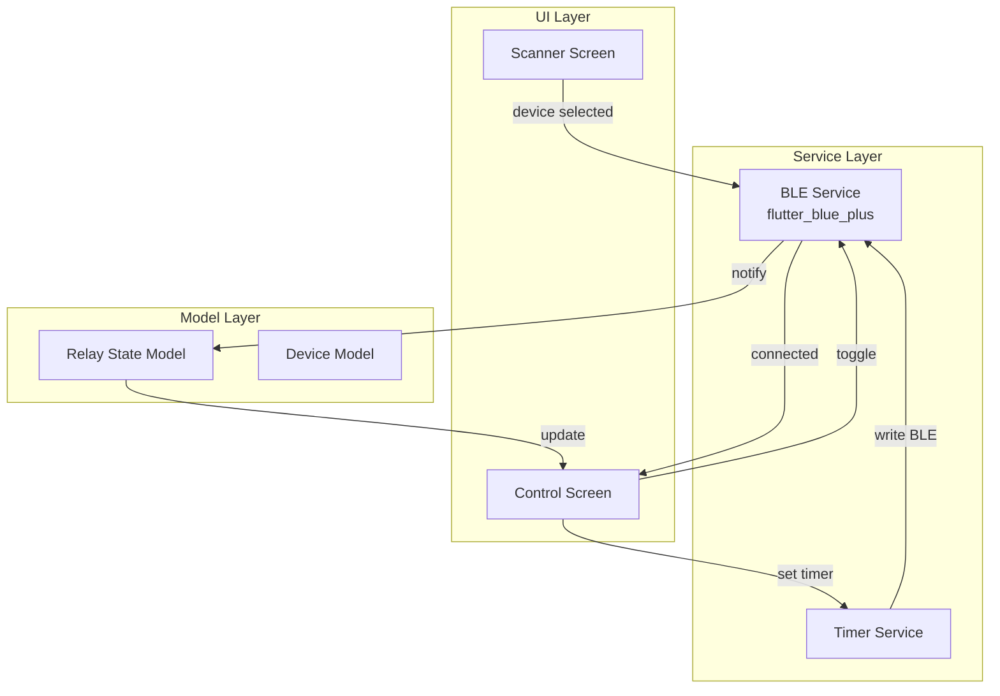
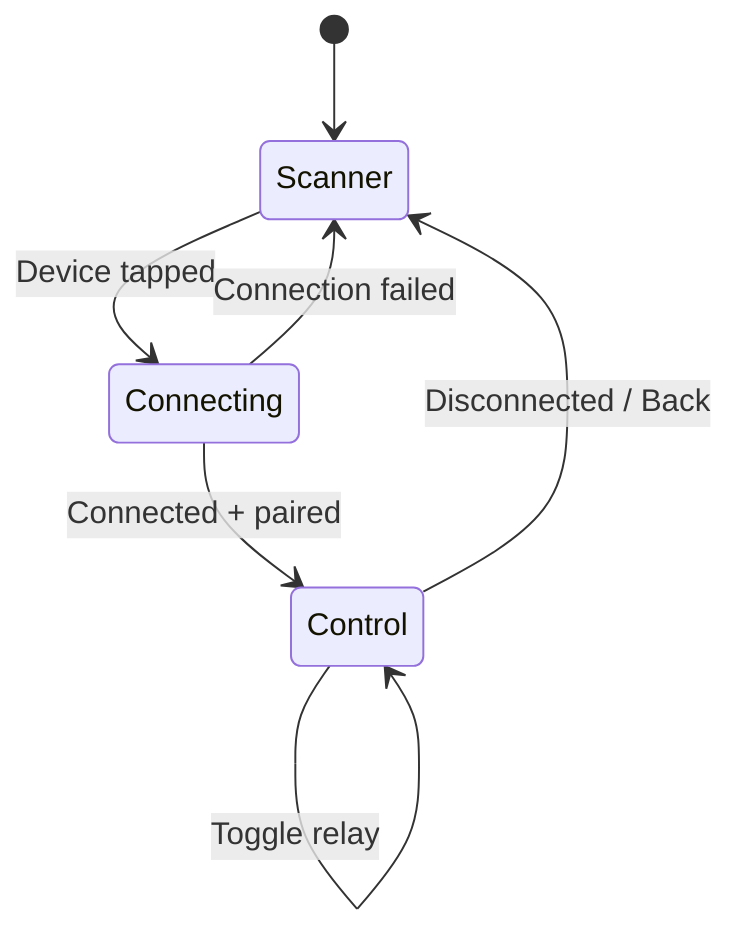
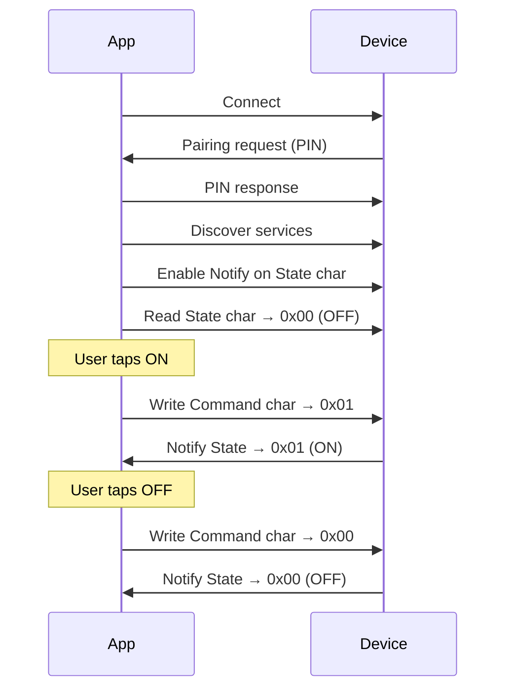

# App Architecture — xiao-remote-button

## Overview

Minimal Android companion app built with Flutter to control a BLE relay device. Connects to a single xiao-relay device, toggles relay state, and displays real-time feedback.

## Architecture Diagram



## Screen Flow



## Module Responsibilities

### Scanner Screen (`screens/scanner/`)
- Start/stop BLE scan filtered by relay service UUID
- Display discovered devices with name + signal strength
- Handle states: scanning, found, empty, BLE off, permission denied
- Tap → connect to device

### Control Screen (`screens/control/`)
- Large relay toggle button (ON/OFF)
- State indicator (color: green=ON, gray=OFF)
- Connection status bar (connected / reconnecting / disconnected)
- Timer input for auto-off feature (Phase 2)
- Disconnect button → return to scanner

### BLE Service (`services/ble_service.dart`)
- Singleton managing one active connection
- API:
  - `scan()` → Stream of discovered devices
  - `connect(device)` → Future (handles pairing)
  - `disconnect()`
  - `sendCommand(RelayCommand.on / .off)`
  - `readState()` → RelayState
  - `stateStream` → Stream<RelayState> (from Notify)
- Handles:
  - Service/characteristic discovery
  - PIN pairing dialog
  - Auto-disconnect cleanup
  - Connection state events

### Timer Service (`services/timer_service.dart`) — Phase 2
- Send timer duration to device
- Track countdown locally for UI display
- Handle timer-triggered-off notification

### Models

```dart
enum RelayState { on, off, unknown }

enum ConnectionState { disconnected, connecting, connected, error }

class RelayDevice {
  final String id;
  final String name;
  final int rssi;
}
```

## BLE Communication Protocol



## State Management

Simple approach for MVP:

- **ChangeNotifier + Provider** (or equivalent lightweight pattern)
- BLE Service exposes Streams
- Screens listen to streams and rebuild on state change
- No complex state management needed for single-device, single-screen interaction

## Error Handling Strategy

| Scenario | App Behavior |
|----------|-------------|
| BLE off | Show "Enable Bluetooth" message + settings link |
| Permission denied | Show explanation + retry button |
| Device not found | Show "No devices found" + rescan button |
| Connection failed | Show error + retry button |
| Pairing rejected | Show "Pairing failed" + retry |
| Unexpected disconnect | Show banner "Disconnected", auto-navigate to scanner after 5s |
| Write failed | Show toast "Command failed", retry automatically once |

## Directory Structure

```
app/
├── lib/
│   ├── main.dart
│   ├── screens/
│   │   ├── scanner/
│   │   │   └── scanner_screen.dart
│   │   └── control/
│   │       └── control_screen.dart
│   ├── services/
│   │   ├── ble_service.dart
│   │   └── timer_service.dart
│   ├── models/
│   │   ├── relay_state.dart
│   │   └── relay_device.dart
│   └── widgets/
│       ├── relay_toggle_button.dart
│       └── connection_banner.dart
├── test/
│   ├── services/
│   │   └── ble_service_test.dart
│   └── screens/
│       ├── scanner_screen_test.dart
│       └── control_screen_test.dart
├── pubspec.yaml
└── android/
    └── app/src/main/AndroidManifest.xml   # BLE permissions
```

## Design Decisions

1. **Single device connection** — Simplifies UX and BLE lifecycle management
2. **No local persistence (MVP)** — No saved state, always fresh from device
3. **Notify over polling** — Real-time state via BLE notifications, no periodic reads
4. **Thin service layer** — BLE service encapsulates all Bluetooth complexity; screens stay simple
5. **No background service (MVP)** — Connection only while app is in foreground
6. **Provider for state** — Lightest viable state management for this scope
