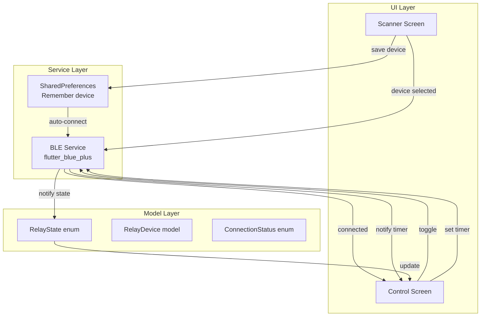
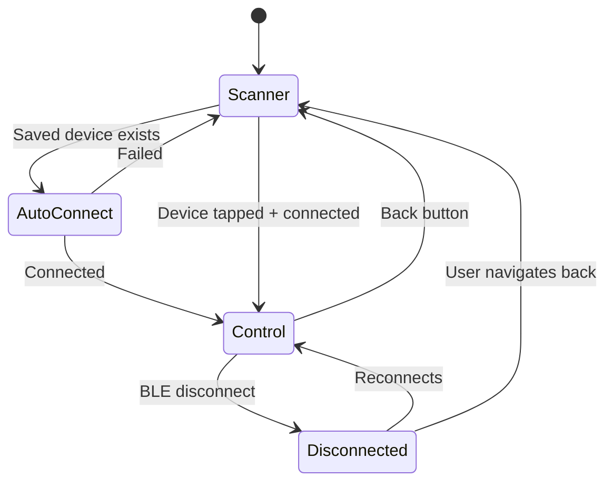
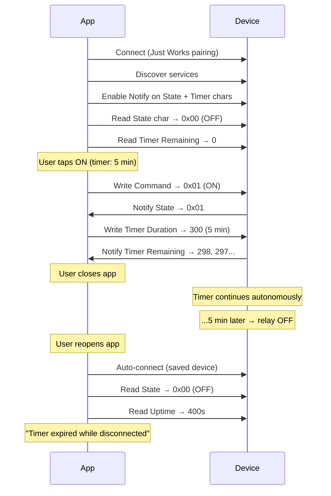

# App Architecture — fip-remote-button

## Overview

Minimal Android companion app built with Flutter to control a BLE relay device.
Connects to a single xiao-relay device, toggles relay state, manages timer, and displays real-time feedback.
Supports autonomous operation — the device continues working after the app disconnects.

## Architecture Diagram



## Screen Flow



## Module Responsibilities

### Scanner Screen (`screens/scanner/`)
- Start/stop BLE scan filtered by relay service UUID
- Display discovered devices with name + signal strength
- Auto-connect to last saved device on app launch
- "Forget device" button in app bar to clear saved device
- Handle states: scanning, found, empty, BLE off, auto-connecting

### Control Screen (`screens/control/`)
- Large relay toggle button (ON/OFF) with haptic feedback
- State indicator (text: ON/OFF)
- Timer dropdown selector (0, 1, 5, 10, 30, 60, 120, 360 min)
- Countdown display (MM:SS) with progress bar
- Disconnect detection with autonomous operation message
- Reconnect logic:
  - Detects timer expiry during disconnect → shows snackbar
  - Detects device restart (uptime < 30s) → shows safety notice
  - Detects timer drift (> 5s) → shows amber warning
- "Back to scanner" button on disconnect

### BLE Service (`services/ble_service.dart`)
- Singleton managing one active connection
- API:
  - `scan()` → Stream of discovered devices
  - `connect(deviceId)` / `disconnect()`
  - `writeRelay(bool on)` → Future<bool>
  - `readRelayState()` → Future<RelayState>
  - `writeTimerDuration(int seconds)`
  - `readTimerRemaining()` → Future<int>
  - `readUptime()` → Future<int>
- Streams:
  - `statusStream` → Stream<ConnectionStatus>
  - `relayStateStream` → Stream<RelayState> (from BLE Notify)
  - `timerRemainingStream` → Stream<int> (from BLE Notify)

### BLE Constants (`services/ble_constants.dart`)
- Service UUID: `00001523-1212-efde-1523-785feabcd123`
- Relay Command: `00001524-...` (Write)
- Relay State: `00001525-...` (Read+Notify)
- Timer Duration: `00001526-...` (Write, uint16 LE seconds)
- Timer Remaining: `00001527-...` (Read+Notify, uint16 LE seconds)
- Uptime: `00001528-...` (Read, uint32 LE seconds)

### Models

```dart
enum RelayState { on, off, unknown }

enum ConnectionStatus { disconnected, connecting, connected, error }

class RelayDevice {
  final String id;
  final String name;
  final int rssi;
}
```

## BLE Communication Protocol



## Features

| Feature | Implementation |
|---------|---------------|
| Remember device | SharedPreferences (device ID + name) |
| Auto-connect | On launch, connect to saved device directly |
| Dark/Light theme | ThemeMode.system (follows OS setting) |
| Haptic feedback | HapticFeedback.mediumImpact() on relay toggle |
| Timer drift detection | Compare expected vs actual remaining on reconnect |
| Autonomous awareness | Shows "Device running autonomously" on disconnect |

## Directory Structure

```
app/
├── lib/
│   ├── main.dart                    # MaterialApp + theme config
│   ├── screens/
│   │   ├── scanner/
│   │   │   └── scanner_screen.dart  # BLE scan + auto-connect
│   │   └── control/
│   │       └── control_screen.dart  # Relay toggle + timer UI
│   ├── services/
│   │   ├── ble_service.dart         # BLE communication singleton
│   │   └── ble_constants.dart       # UUIDs
│   └── models/
│       ├── relay_state.dart         # RelayState enum
│       └── relay_device.dart        # Device model
├── test/
│   ├── widget_test.dart             # App theme tests (3)
│   ├── models_test.dart             # Model tests
│   └── control_screen_test.dart     # Control screen tests (22)
└── pubspec.yaml
```

## Design Decisions

| # | Decision | Rationale |
|---|----------|-----------|
| 1 | No auto-reconnect loop | Device works autonomously; user reconnects manually |
| 2 | No background service | BLE only while app is in foreground (MVP) |
| 3 | Singleton BLE service | Single device, single connection — simplest model |
| 4 | Stream-based state | Screens listen to BLE streams and rebuild reactively |
| 5 | SharedPreferences | Lightest persistence for saved device ID |
| 6 | No state management lib | StatefulWidget + streams sufficient for this scope |
| 7 | mocktail for tests | Allows mocking BleService without BLE hardware |

## Test Coverage

- **25 tests total** (0 failures)
- Control screen: 22 widget tests (all states, timer, reconnect, drift)
- App/theme: 3 unit tests
- Analyze: 0 issues
