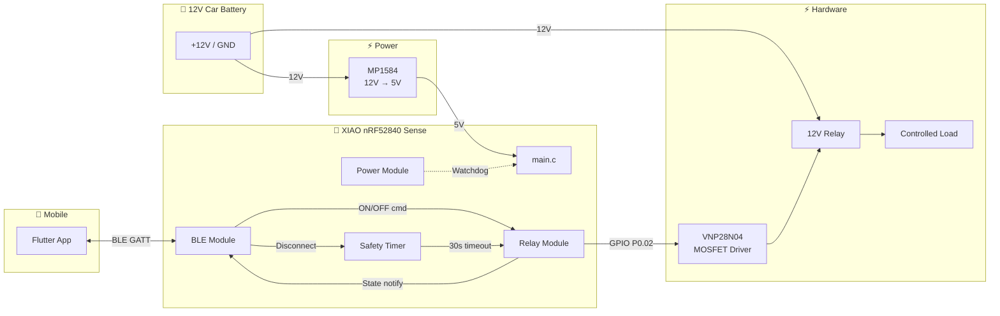
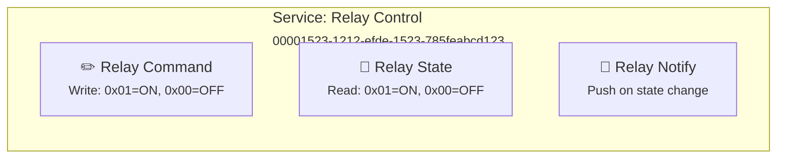
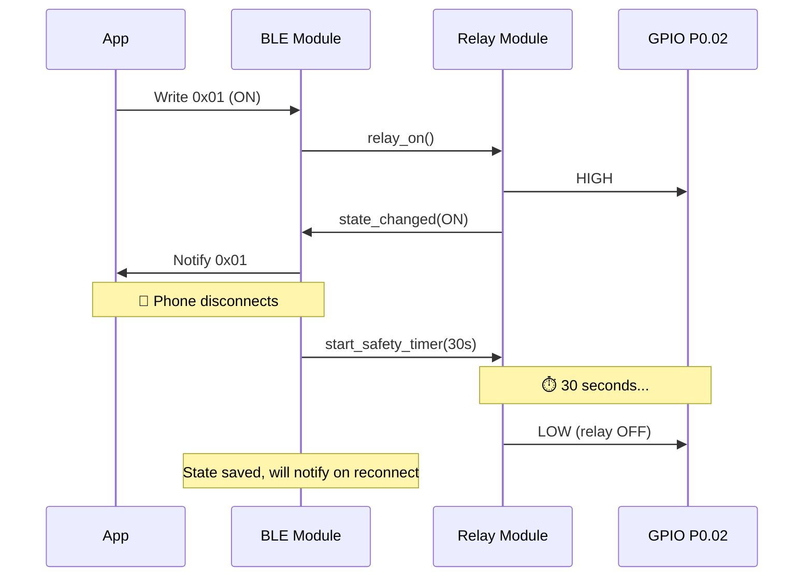
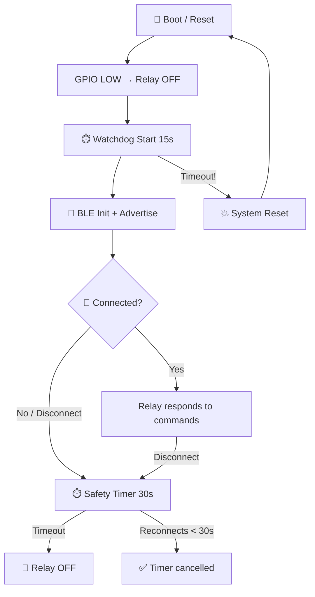
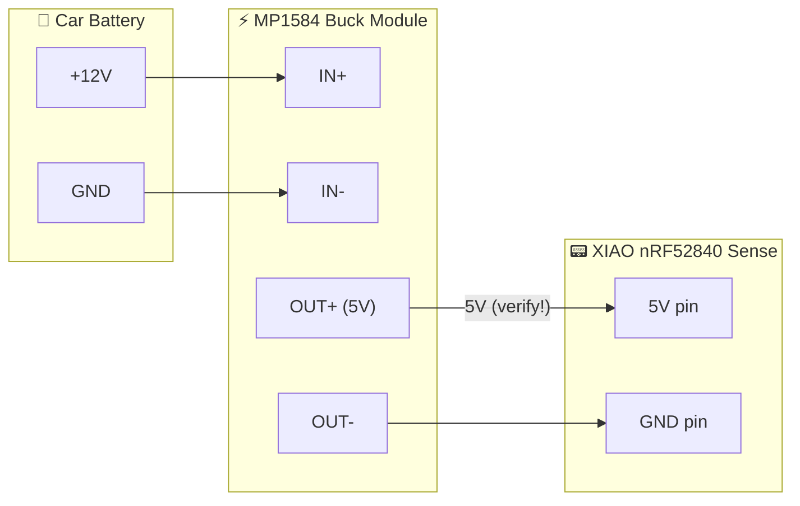
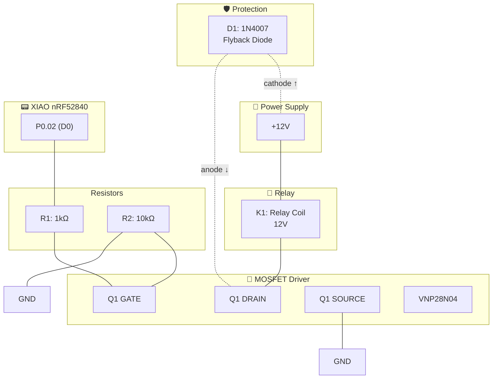
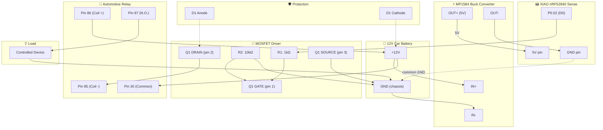

# Firmware Architecture — xiao-remote-button

## Overview

Minimal BLE-controlled relay firmware for **Seeed XIAO nRF52840 Sense** using nRF Connect SDK (Zephyr RTOS).  
Designed for ultra-low power operation from a 12V car battery with fail-safe relay control.

---

## System Diagram



---

## Software Modules

### `main.c` — Entry Point

| Responsibility | Detail |
|----------------|--------|
| Init GPIO | Relay OFF at boot (fail-safe) |
| Init USB | Debug console (development) |
| Init BLE | Advertise as "xiao-relay" |
| Main loop | Feed watchdog + idle (Zephyr PM) |

### `src/ble/` — BLE Module

- Custom GATT service (UUID: `00001523-1212-efde-1523-785feabcd123`)
- GAP: advertising, pairing PIN, connection management
- On disconnect → activates safety timer
- On reconnect → cancels safety timer

### `src/relay/` — Relay Module

- API: `relay_init()`, `relay_on()`, `relay_off()`, `relay_get_state()`
- Always starts in OFF state
- Extensible: relay index parameter for future multi-relay support

### `src/power/` — Power Module

- Hardware watchdog (15s)
- Optimized BLE connection intervals
- Zephyr PM manages sleep automatically

### Safety Timer

- Starts on BLE disconnect
- 30-second countdown
- On expiry → `relay_off()`
- If reconnects before expiry → cancels timer, relay keeps state

---

## BLE GATT Service



**Security**: Just Works pairing (no PIN) · Bonding enabled

---

## Data Flow



---

## Fail-Safe Priority Chain



---

## Hardware: Power Supply

### MP1584 Buck Converter Module

Converts the 12V car battery to 5V for the XIAO nRF52840.

| Parameter | Value |
|-----------|-------|
| Input voltage | 4.5V – 28V |
| Output voltage | 0.8V – 20V (adjustable via trimmer) |
| Output current | 3A max |
| Efficiency | Up to 96% |
| Set output to | **5V** (adjust trimmer before connecting XIAO) |

### Power Wiring



### Setup Procedure

1. **Before connecting XIAO**: Power the MP1584 from 12V and adjust the trimmer potentiometer until output reads **5.0V** on a multimeter
2. Connect MP1584 OUT+ → XIAO **5V pin** (not 3V3!)
3. Connect MP1584 OUT- → XIAO **GND pin**
4. Connect MP1584 IN- → Battery GND → MOSFET circuit GND (common ground)

> ⚠️ **Critical**: Always verify the MP1584 output is 5V before connecting to XIAO. Output above 6V will damage the board.

> 💡 **Tip**: The XIAO has an onboard 3.3V regulator. Feeding 5V to the 5V pin lets the XIAO regulate internally.

---

## Hardware: Relay Driver Circuit

### Bill of Materials

| Ref | Component | Value | Function |
|-----|-----------|-------|----------|
| U1 | MP1584 | Buck module | 12V → 5V power supply for XIAO |
| Q1 | VNP28N04 | N-ch OmniFET (ST) | Relay switching, self-protected |
| R1 | Resistor | 1 kΩ | Gate current limiter |
| R2 | Resistor | 10 kΩ | Gate pull-down (fail-safe) |
| D1 | 1N4007 | Rectifier diode | Flyback protection |
| K1 | Relay | 12V coil | Switched load |

### VNP28N04 — Key Specifications

| Parameter | Value | Note |
|-----------|-------|------|
| Vgs(th) | 0.8V min, 3.0V max | ✅ Compatible with 3.3V GPIO |
| Rds(on) | ~50 mΩ @ Vgs=5V | Negligible losses |
| Id max | 10A continuous | Well above relay requirements |
| Protections | Overcurrent, overtemp, ESD | Built-in |
| Package | TO-220 | — |

### Schematic



### Wiring — Step by Step

| # | From | To | Wire/Component |
|---|------|-----|----------------|
| 1 | XIAO pin P0.02 (D0) | R1 (terminal 1) | Signal wire |
| 2 | R1 (terminal 2) | Q1 pin GATE | Short wire |
| 3 | Q1 pin GATE | R2 (terminal 1) | Short wire |
| 4 | R2 (terminal 2) | GND | GND wire |
| 5 | Q1 pin SOURCE | GND | GND wire |
| 6 | Q1 pin DRAIN | Relay coil (-) | Power wire |
| 7 | Relay coil (+) | +12V | Power wire |
| 8 | D1 anode | Q1 DRAIN / Relay (-) | Parallel to relay |
| 9 | D1 cathode | +12V / Relay (+) | Parallel to relay |
| 10 | XIAO GND | Common GND | Shared reference |

> ⚠️ **Important**: The XIAO GND and the 12V circuit GND must be connected together.

### VNP28N04 — Pinout (TO-220, vista frontal)

```
        ┌──────────┐
        │          │
        │ VNP28N04 │
        │          │
        └──┬──┬──┬─┘
           │  │  │
           1  2  3
           │  │  │
         GATE │ SOURCE
             DRAIN
```

### Design Notes

| # | Component | Rationale |
|---|-----------|-----------|
| 1 | **R1 (1kΩ)** | Limits peak current when charging gate capacitance. Protects XIAO GPIO. |
| 2 | **R2 (10kΩ)** | Keeps gate at GND when GPIO is high-impedance (boot/reset). **Critical for fail-safe.** |
| 3 | **D1 (1N4007)** | Absorbs inductive spike when relay turns off. Without it, the voltage spike destroys Q1. |
| 4 | **VNP28N04** | Self-protected: if relay short-circuits, Q1 self-limits instead of burning out. |

### Control Logic

| GPIO P0.02 | Gate Voltage | MOSFET | Relay |
|-----------|-------------|--------|-------|
| LOW (0V) | 0V (R2 pull-down) | OFF (open) | ⚪ Deactivated |
| HIGH (3.3V) | ~3.3V (> Vgs_th) | ON (conducting) | 🔴 Activated |
| High-Z (boot) | 0V (R2 pull-down) | OFF (open) | ⚪ Deactivated (safe) |

---

## Power Budget

| System State | 12V Consumption | 5V Rail (MP1584) | Notes |
|--------------|-----------------|------------------|-------|
| Idle (BLE advertising) | ~5 mA | ~12 mA | XIAO only (via buck) |
| Relay ON | 55-105 mA | ~12 mA | Relay powered directly from 12V |
| Deep sleep (future) | < 1 mA | < 3 mA | With PM optimization |

> Note: The relay coil draws from 12V directly (not through the MP1584). The buck only powers the XIAO.

---

## Complete Wiring Guide

This section describes how to interconnect all physical components into a working system.

### Components List

| # | Component | Description |
|---|-----------|-------------|
| 1 | 12V Car Battery | Power source |
| 2 | MP1584 Buck Module | Voltage regulator 12V → 5V |
| 3 | Seeed XIAO nRF52840 Sense | BLE microcontroller |
| 4 | VNP28N04 (TO-220) | N-channel MOSFET driver |
| 5 | Automotive Relay (12V coil) | 5-pin SPDT relay (30A/40A typical) |
| 6 | R1 — 1kΩ resistor | Gate current limiter |
| 7 | R2 — 10kΩ resistor | Gate pull-down |
| 8 | D1 — 1N4007 diode | Flyback protection |

### Automotive Relay Pinout (5-pin SPDT)

```
        ┌─────────────────────┐
        │   AUTOMOTIVE RELAY  │
        │                     │
        │  [87a]  [87]  [30] │    ← Switched contacts (top)
        │                     │
        │     [85]    [86]    │    ← Coil terminals (bottom)
        └─────────────────────┘

Pin 85: Coil terminal (–) → connects to MOSFET DRAIN
Pin 86: Coil terminal (+) → connects to +12V
Pin 30: Common contact   → connects to your LOAD power source
Pin 87: Normally Open    → connects to your LOAD (ON when relay energized)
Pin 87a: Normally Closed → not used (load is OFF by default)
```

> 💡 In our circuit: when the relay is **energized** (coil ON), pin 30 connects to pin 87 → load is powered.

### Full System Schematic



### Step-by-Step Wiring Instructions

#### Phase 1: Power Supply (MP1584 → XIAO)

| Step | Action | Details |
|------|--------|---------|
| 1 | **Set MP1584 output to 5V** | Connect MP1584 IN+ to 12V, IN- to GND. Turn trimmer until multimeter reads **5.0V** on OUT+. **Do this BEFORE connecting XIAO.** |
| 2 | MP1584 IN+ → Battery +12V | Red power wire |
| 3 | MP1584 IN- → Battery GND | Black power wire |
| 4 | MP1584 OUT+ → XIAO **5V** pin | Red signal wire (use the 5V pad, NOT 3V3) |
| 5 | MP1584 OUT- → XIAO **GND** pin | Black signal wire |

> ✅ **Checkpoint**: Power on. XIAO red LED should blink (if firmware loaded) or stay solid (bootloader).

#### Phase 2: MOSFET Driver (XIAO → VNP28N04)

| Step | Action | Details |
|------|--------|---------|
| 6 | XIAO P0.02 (D0) → R1 (terminal 1) | Signal wire from XIAO header |
| 7 | R1 (terminal 2) → Q1 GATE (pin 1) | Short wire, keep close |
| 8 | Q1 GATE (pin 1) → R2 (terminal 1) | Short wire |
| 9 | R2 (terminal 2) → GND bus | Ensures gate stays LOW when GPIO is floating |
| 10 | Q1 SOURCE (pin 3) → GND bus | MOSFET ground reference |

> ✅ **Checkpoint**: With no relay connected, measure Q1 DRAIN. Should read ~12V when GPIO is LOW (MOSFET off, drain floats to coil voltage once relay is connected).

#### Phase 3: Relay + Flyback Diode

| Step | Action | Details |
|------|--------|---------|
| 11 | Q1 DRAIN (pin 2) → Relay **pin 85** (coil -) | Power wire (handles relay coil current ~50-100mA) |
| 12 | Relay **pin 86** (coil +) → Battery +12V | Power wire |
| 13 | D1 **anode** → Relay pin 85 / Q1 DRAIN | In parallel with relay coil (same node) |
| 14 | D1 **cathode** (band side) → Relay pin 86 / +12V | In parallel with relay coil (same node) |

> ⚠️ **D1 polarity is critical**: cathode (stripe) goes to +12V. Reversed diode = short circuit!

> ✅ **Checkpoint**: With firmware running, trigger GPIO HIGH → you should hear the relay click.

#### Phase 4: Load Connection

| Step | Action | Details |
|------|--------|---------|
| 15 | Relay **pin 30** (common) → +12V or load power source | This is the "input" of the switch |
| 16 | Relay **pin 87** (N.O.) → Load (+) | Normally Open = connected only when relay is ON |
| 17 | Load (-) → GND | Complete the load circuit |

> 💡 Pin 87a (Normally Closed) is unused. The load is OFF by default (fail-safe).

#### Phase 5: Common Ground

| Step | Action | Details |
|------|--------|---------|
| 18 | **Connect all GNDs together** | XIAO GND = MP1584 OUT- = Battery GND = Q1 SOURCE = R2 GND |

> ⚠️ **Critical**: All grounds MUST be the same node. A floating ground will cause erratic MOSFET behavior.

### Complete Connection Summary

```
12V BATTERY (+) ──┬── MP1584 IN+ ── [adjust to 5V] ── OUT+ → XIAO 5V pin
                  ├── Relay Pin 86 (coil +)
                  ├── D1 cathode (band)
                  └── Relay Pin 30 (common) ── [to load source]

GND (CHASSIS) ────┬── MP1584 IN-
                  ├── MP1584 OUT- → XIAO GND pin
                  ├── R2 (terminal 2)
                  ├── Q1 SOURCE (pin 3)
                  └── Load (-)

XIAO P0.02 (D0) ──── R1 (1kΩ) ──┬── Q1 GATE (pin 1)
                                 └── R2 (10kΩ) ── GND

Q1 DRAIN (pin 2) ──┬── Relay Pin 85 (coil -)
                   └── D1 anode

Relay Pin 87 (N.O.) ── Load (+)
Relay Pin 87a (N.C.) ── not connected
```

### Safety Checklist

- [ ] MP1584 output verified at 5.0V before connecting XIAO
- [ ] D1 diode orientation correct (cathode/band to +12V)
- [ ] R2 pull-down present (relay stays OFF during boot/reset)
- [ ] All grounds connected to same bus
- [ ] No exposed metal that could short to chassis
- [ ] Relay rated for load current (check pin 30/87 rating, typically 30A)
- [ ] Fuse on +12V line recommended (e.g., 5A inline fuse)

---

## Directory Structure

```
micro/
├── CMakeLists.txt                    # Build config
├── prj.conf                          # Kconfig (BLE, GPIO, USB, logging)
├── boards/
│   └── xiao_ble_nrf52840_sense.overlay  # P0.02 relay GPIO + alias
├── src/
│   ├── main.c                        # Entry point
│   ├── ble/
│   │   ├── ble_relay_service.h       # BLE public API
│   │   └── ble_relay_service.c       # GATT + advertising
│   ├── relay/
│   │   ├── relay.h                   # Relay control API
│   │   └── relay.c                   # GPIO logic + fail-safe
│   └── power/
│       ├── power.h                   # Watchdog + sleep API
│       └── power.c                   # WDT + PM config
├── include/
│   └── app_config.h                  # Constants: pins, timeouts, UUIDs
└── tests/
    ├── test_relay.c
    └── test_safety_timer.c
```

---

## Configuration Constants

| Constant | Value | Description |
|----------|-------|-------------|
| `RELAY_GPIO_PIN` | P0.02 (D0) | MOSFET gate control |
| `RELAY_ACTIVE_LEVEL` | HIGH | HIGH = relay ON |
| `BLE_DISCONNECT_TIMEOUT_S` | 30 | Fail-safe timeout |
| `WDT_TIMEOUT_S` | 15 | Hardware watchdog |
| `BLE_DEVICE_NAME` | "xiao-relay" | Advertising name |
| `BLE_PIN` | 123456 | Pairing passkey |
| `BLE_SERVICE_UUID` | 00001523-1212-efde-1523-785feabcd123 | Custom service |

---

## Design Decisions

| # | Decision | Rationale |
|---|----------|-----------|
| 1 | Single-threaded | BLE callbacks + workqueue sufficient for MVP |
| 2 | Static allocation | No malloc, everything at compile time |
| 3 | Extensible relay API | Index parameter for future multi-relay |
| 4 | Hardware watchdog | Survives firmware bugs (vs software timer) |
| 5 | Bonding | Reconnection without re-entering PIN |
| 6 | USB CDC in development | Serial console logs, removable in production |
| 7 | `--no-sysbuild` | NCS Partition Manager incompatible with Adafruit UF2 bootloader |

---

## Build Notes

```bash
# Build (mandatory flags for Adafruit UF2 bootloader)
west build -b xiao_ble/nrf52840/sense micro -d micro/build/micro \
    --no-sysbuild -- -DCONFIG_PARTITION_MANAGER_ENABLED=n

# Flash (double-tap RESET to enter bootloader)
cp micro/build/micro/zephyr/zephyr.uf2 /media/$USER/XIAO-SENSE/

# Serial monitor
screen /dev/ttyACM0 115200
```
