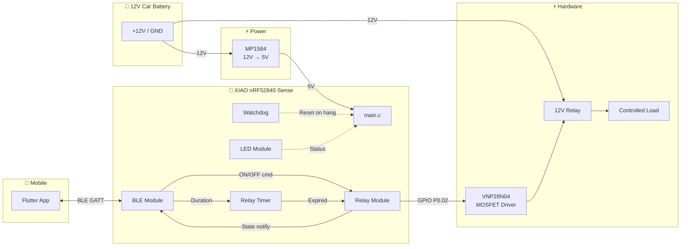
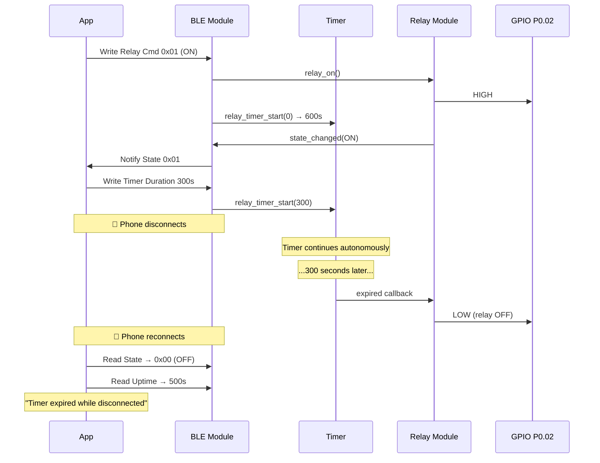
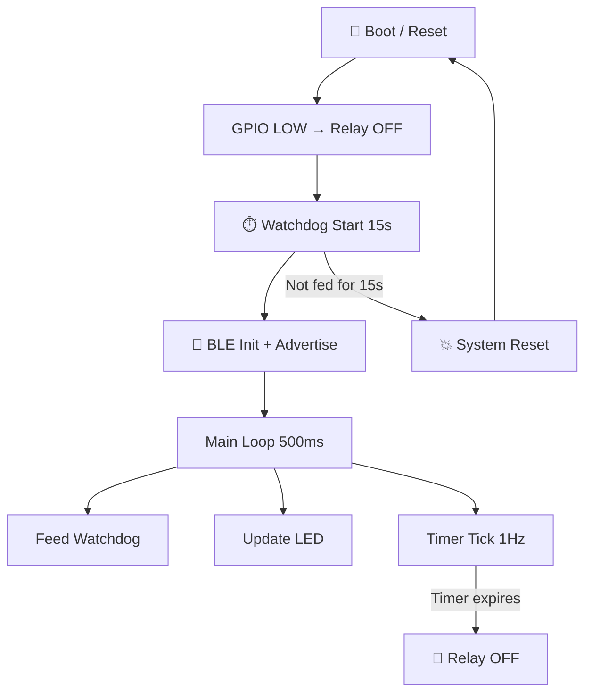

# Firmware Architecture — xiao-remote-button

## Overview

Minimal BLE-controlled relay firmware for **Seeed XIAO nRF52840 Sense** using nRF Connect SDK (Zephyr RTOS).  
Designed for ultra-low power autonomous operation from a 12V car battery with timer-based auto-off.

---

## System Diagram



---

## Software Modules

### `main.c` — Entry Point

| Responsibility | Detail |
|----------------|--------|
| Init all modules | Relay, BLE, LED, Timer, Watchdog |
| Main loop (500ms) | Feed watchdog, update LED, tick timer (1Hz), notify timer |
| Uptime counter | Incremented at 1Hz for reconnect diagnostics |

### `src/ble/` — BLE Module

- Custom GATT service (UUID: `00001523-1212-efde-1523-785feabcd123`)
- 5 characteristics: Relay Command, Relay State, Timer Duration, Timer Remaining, Uptime
- Advertising: 100–150ms intervals, connectable, device name "xiao-relay"
- Connection params: 100–500ms intervals, slave latency 4, timeout 10s
- On relay ON → starts timer (default 10min if no duration set)
- On relay OFF → cancels timer

### `src/relay/` — Relay Module

- API: `relay_init()`, `relay_on()`, `relay_off()`, `relay_get_state()`
- State change callback for BLE notifications
- Always starts in OFF state (GPIO_OUTPUT_INACTIVE)
- HAL layer (`relay_hal.c`) isolates GPIO hardware

### `src/led/` — LED Module

- RGB status code driven by relay + BLE state
- 4 states + error:
  - Blue blinking: Relay ON + BLE connected
  - Blue solid: Relay ON + BLE disconnected
  - Green blinking: Relay OFF + BLE connected
  - Green solid: Relay OFF + BLE disconnected
  - Red blinking: Error
- HAL layer (`led_hal.c`) for GPIO control
- Pure logic function `led_compute_state()` for unit testing

### `src/timer/` — Relay Timer

- Pure logic module (no Zephyr dependencies — fully testable)
- Tick-based: `relay_timer_tick()` called at 1Hz from main loop
- Duration 0 → caps at 600s (10 min, indefinite mode)
- Duration N → caps at 21600s (6 hours)
- On expiry → fires callback → `relay_off()`
- API: `start()`, `cancel()`, `remaining()`, `is_running()`, `tick()`

### `src/watchdog/` — Watchdog

- Hardware watchdog (15s timeout)
- Fed from main loop every 500ms
- On timeout → system reset → GPIO LOW → relay OFF (fail-safe)

---

## BLE GATT Service

| Characteristic | UUID suffix | Properties | Description |
|----------------|-------------|-----------|-------------|
| Relay Command | `1524` | Write | `0x01`=ON, `0x00`=OFF |
| Relay State | `1525` | Read, Notify | Current state (1 byte) |
| Timer Duration | `1526` | Write | uint16 LE (seconds, 0=10min default) |
| Timer Remaining | `1527` | Read, Notify | uint16 LE (seconds) |
| Uptime | `1528` | Read | uint32 LE (seconds since boot) |

**Security**: Just Works pairing (no PIN) · Bonding enabled

---

## Data Flow



---

## Fail-Safe Design



**No safety-on-disconnect**: The relay maintains its state when BLE disconnects. The timer handles auto-off independently.

---

## Directory Structure

```
micro/
├── CMakeLists.txt
├── prj.conf                          # Kconfig (BLE, GPIO, USB, PM, WDT)
├── boards/
│   └── xiao_ble_nrf52840_sense.overlay  # P0.02 relay GPIO
├── src/
│   ├── main.c                        # Entry point + main loop
│   ├── ble/
│   │   ├── ble_relay_service.h       # BLE public API
│   │   └── ble_relay_service.c       # GATT + advertising + timer
│   ├── relay/
│   │   ├── relay.h / relay.c         # State logic + callback
│   │   └── relay_hal.h / relay_hal.c # GPIO hardware
│   ├── led/
│   │   ├── led.h / led.c            # State-to-color logic
│   │   └── led_hal.h / led_hal.c    # GPIO hardware (RGB)
│   ├── timer/
│   │   ├── relay_timer.h            # Timer API
│   │   └── relay_timer.c            # Pure logic countdown
│   └── watchdog/
│       ├── watchdog.h               # WDT API
│       └── watchdog.c               # Hardware watchdog
└── tests/
    ├── test_relay.c                  # 13 tests (100% coverage)
    ├── test_led.c                    # 11 tests (91% coverage)
    └── test_relay_timer.c            # 13 tests (100% coverage)
```

---

## Configuration (prj.conf)

| Config | Value | Purpose |
|--------|-------|---------|
| `CONFIG_BT_DEVICE_NAME` | "xiao-relay" | Advertising name |
| `CONFIG_BT_PERIPHERAL_PREF_MIN_INT` | 80 (100ms) | Min connection interval |
| `CONFIG_BT_PERIPHERAL_PREF_MAX_INT` | 400 (500ms) | Max connection interval |
| `CONFIG_BT_PERIPHERAL_PREF_LATENCY` | 4 | Slave latency |
| `CONFIG_BT_PERIPHERAL_PREF_TIMEOUT` | 1000 (10s) | Supervision timeout |
| `CONFIG_PM` | y | Zephyr idle sleep |
| `CONFIG_WDT_NRFX` | y | Hardware watchdog |

---

## Hardware: Relay Driver Circuit

### Bill of Materials

| Ref | Component | Value | Function |
|-----|-----------|-------|----------|
| U1 | MP1584 | Buck module | 12V → 5V power supply for XIAO |
| Q1 | VNP28N04 | N-ch OmniFET (ST) | Relay switching, self-protected |
| R1 | Resistor | 1 kΩ | Gate current limiter |
| R2 | Resistor | 10 kΩ | Gate pull-down (fail-safe) |
| D1 | 1N4007 | Rectifier diode | Flyback protection |
| K1 | Relay | 12V coil | Switched load |

### Control Logic

| GPIO P0.02 | Gate Voltage | MOSFET | Relay |
|-----------|-------------|--------|-------|
| LOW (0V) | 0V (R2 pull-down) | OFF (open) | ⚪ Deactivated |
| HIGH (3.3V) | ~3.3V (> Vgs_th) | ON (conducting) | 🔴 Activated |
| High-Z (boot) | 0V (R2 pull-down) | OFF (open) | ⚪ Deactivated (safe) |

---

## Design Decisions

| # | Decision | Rationale |
|---|----------|-----------|
| 1 | No safety-on-disconnect | Device operates autonomously; timer handles auto-off |
| 2 | Pure logic timer | No Zephyr dependencies → fully unit-testable |
| 3 | Tick-based (1Hz) | Simple, accurate (0% drift over 5 min measured) |
| 4 | Static allocation | No malloc, everything at compile time |
| 5 | Hardware watchdog | Survives firmware bugs (vs software timer) |
| 6 | `--no-sysbuild` | NCS Partition Manager incompatible with UF2 bootloader |
| 7 | HAL pattern | Enables Ceedling unit testing via CMock |
| 8 | CONFIG_PM=y | Automatic idle sleep, no code changes needed |

---

## Build & Flash

```bash
# Build (mandatory: --no-sysbuild for UF2 bootloader at 0x27000)
ZEPHYR_TOOLCHAIN_VARIANT=cross-compile \
CROSS_COMPILE=/usr/bin/arm-none-eabi- \
ZEPHYR_BASE=~/ncs/zephyr \
  west build -b xiao_ble/nrf52840/sense --no-sysbuild .

# Flash (double-tap RESET → XIAO-SENSE USB drive)
cp build/zephyr/zephyr.uf2 /media/$USER/XIAO-SENSE/
sync

# Tests
ceedling test:all       # 37 tests
ceedling gcov:all       # 96% coverage
```
