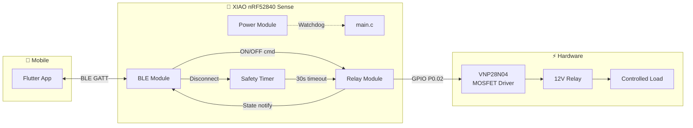
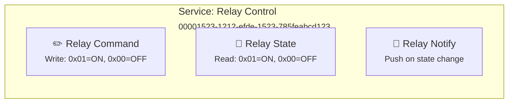
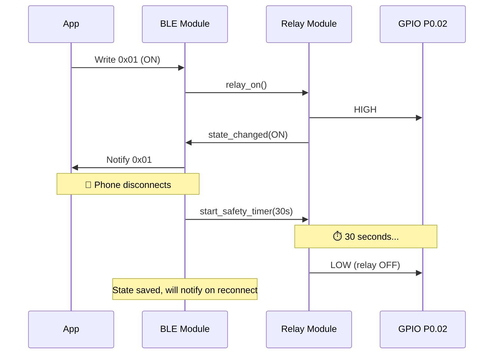
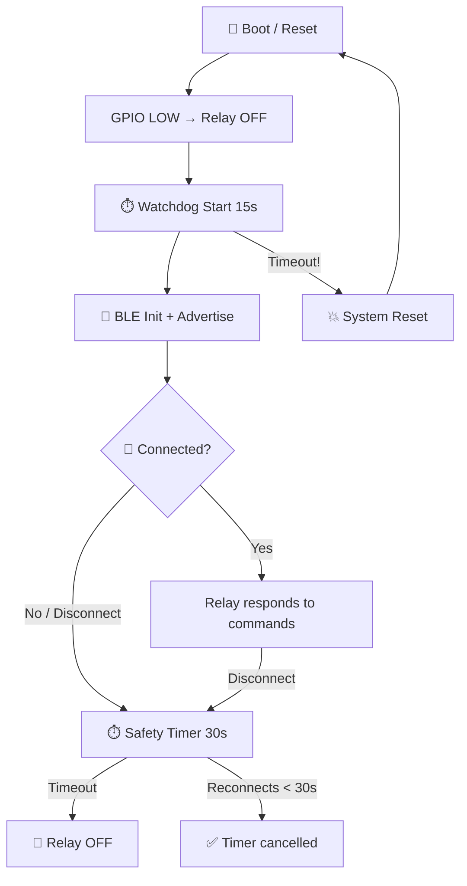
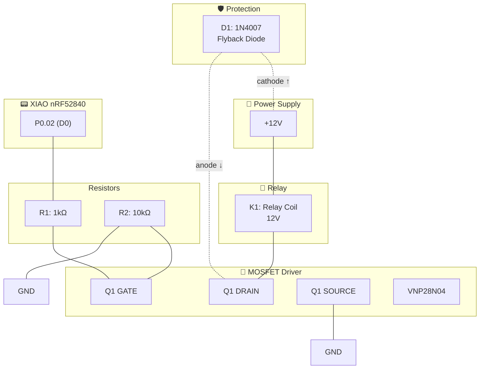

# Firmware Architecture — xiao-remote-button

## Overview

Minimal BLE-controlled relay firmware for **Seeed XIAO nRF52840 Sense** using nRF Connect SDK (Zephyr RTOS).  
Designed for ultra-low power operation from a 12V car battery with fail-safe relay control.

---

## System Diagram



---

## Software Modules

### `main.c` — Entry Point

| Responsibility | Detail |
|----------------|--------|
| Init GPIO | Relay OFF at boot (fail-safe) |
| Init USB | Debug console (development) |
| Init BLE | Advertise as "xiao-relay" |
| Main loop | Feed watchdog + idle (Zephyr PM) |

### `src/ble/` — BLE Module

- Custom GATT service (UUID: `00001523-1212-efde-1523-785feabcd123`)
- GAP: advertising, pairing PIN, connection management
- On disconnect → activates safety timer
- On reconnect → cancels safety timer

### `src/relay/` — Relay Module

- API: `relay_init()`, `relay_on()`, `relay_off()`, `relay_get_state()`
- Always starts in OFF state
- Extensible: relay index parameter for future multi-relay support

### `src/power/` — Power Module

- Hardware watchdog (15s)
- Optimized BLE connection intervals
- Zephyr PM manages sleep automatically

### Safety Timer

- Starts on BLE disconnect
- 30-second countdown
- On expiry → `relay_off()`
- If reconnects before expiry → cancels timer, relay keeps state

---

## BLE GATT Service



**Security**: LE Secure Connections · Fixed 6-digit passkey · Bonding enabled

---

## Data Flow



---

## Fail-Safe Priority Chain



---

## Hardware: Relay Driver Circuit

### Bill of Materials

| Ref | Component | Value | Function |
|-----|-----------|-------|----------|
| Q1 | VNP28N04 | N-ch OmniFET (ST) | Relay switching, self-protected |
| R1 | Resistor | 1 kΩ | Gate current limiter |
| R2 | Resistor | 10 kΩ | Gate pull-down (fail-safe) |
| D1 | 1N4007 | Rectifier diode | Flyback protection |
| K1 | Relay | 12V coil | Switched load |

### VNP28N04 — Key Specifications

| Parameter | Value | Note |
|-----------|-------|------|
| Vgs(th) | 0.8V min, 3.0V max | ✅ Compatible with 3.3V GPIO |
| Rds(on) | ~50 mΩ @ Vgs=5V | Negligible losses |
| Id max | 10A continuous | Well above relay requirements |
| Protections | Overcurrent, overtemp, ESD | Built-in |
| Package | TO-220 | — |

### Schematic



### Wiring — Step by Step

| # | From | To | Wire/Component |
|---|------|-----|----------------|
| 1 | XIAO pin P0.02 (D0) | R1 (terminal 1) | Signal wire |
| 2 | R1 (terminal 2) | Q1 pin GATE | Short wire |
| 3 | Q1 pin GATE | R2 (terminal 1) | Short wire |
| 4 | R2 (terminal 2) | GND | GND wire |
| 5 | Q1 pin SOURCE | GND | GND wire |
| 6 | Q1 pin DRAIN | Relay coil (-) | Power wire |
| 7 | Relay coil (+) | +12V | Power wire |
| 8 | D1 anode | Q1 DRAIN / Relay (-) | Parallel to relay |
| 9 | D1 cathode | +12V / Relay (+) | Parallel to relay |
| 10 | XIAO GND | Common GND | Shared reference |

> ⚠️ **Important**: The XIAO GND and the 12V circuit GND must be connected together.

### VNP28N04 — Pinout (TO-220, vista frontal)

```
        ┌──────────┐
        │          │
        │ VNP28N04 │
        │          │
        └──┬──┬──┬─┘
           │  │  │
           1  2  3
           │  │  │
         GATE │ SOURCE
             DRAIN
```

### Design Notes

| # | Component | Rationale |
|---|-----------|-----------|
| 1 | **R1 (1kΩ)** | Limits peak current when charging gate capacitance. Protects XIAO GPIO. |
| 2 | **R2 (10kΩ)** | Keeps gate at GND when GPIO is high-impedance (boot/reset). **Critical for fail-safe.** |
| 3 | **D1 (1N4007)** | Absorbs inductive spike when relay turns off. Without it, the voltage spike destroys Q1. |
| 4 | **VNP28N04** | Self-protected: if relay short-circuits, Q1 self-limits instead of burning out. |

### Control Logic

| GPIO P0.02 | Gate Voltage | MOSFET | Relay |
|-----------|-------------|--------|-------|
| LOW (0V) | 0V (R2 pull-down) | OFF (open) | ⚪ Deactivated |
| HIGH (3.3V) | ~3.3V (> Vgs_th) | ON (conducting) | 🔴 Activated |
| High-Z (boot) | 0V (R2 pull-down) | OFF (open) | ⚪ Deactivated (safe) |

---

## Power Budget

| System State | 12V Consumption | Notes |
|--------------|-----------------|-------|
| Idle (BLE advertising) | ~5 mA | XIAO only (internal regulator) |
| Relay ON | 55-105 mA | XIAO + relay coil |
| Deep sleep (future) | < 1 mA | With PM optimization |

---

## Directory Structure

```
micro/
├── CMakeLists.txt                    # Build config
├── prj.conf                          # Kconfig (BLE, GPIO, USB, logging)
├── boards/
│   └── xiao_ble_nrf52840_sense.overlay  # P0.02 relay GPIO + alias
├── src/
│   ├── main.c                        # Entry point
│   ├── ble/
│   │   ├── ble_relay_service.h       # BLE public API
│   │   └── ble_relay_service.c       # GATT + advertising
│   ├── relay/
│   │   ├── relay.h                   # Relay control API
│   │   └── relay.c                   # GPIO logic + fail-safe
│   └── power/
│       ├── power.h                   # Watchdog + sleep API
│       └── power.c                   # WDT + PM config
├── include/
│   └── app_config.h                  # Constants: pins, timeouts, UUIDs
└── tests/
    ├── test_relay.c
    └── test_safety_timer.c
```

---

## Configuration Constants

| Constant | Value | Description |
|----------|-------|-------------|
| `RELAY_GPIO_PIN` | P0.02 (D0) | MOSFET gate control |
| `RELAY_ACTIVE_LEVEL` | HIGH | HIGH = relay ON |
| `BLE_DISCONNECT_TIMEOUT_S` | 30 | Fail-safe timeout |
| `WDT_TIMEOUT_S` | 15 | Hardware watchdog |
| `BLE_DEVICE_NAME` | "xiao-relay" | Advertising name |
| `BLE_PIN` | 123456 | Pairing passkey |
| `BLE_SERVICE_UUID` | 00001523-1212-efde-1523-785feabcd123 | Custom service |

---

## Design Decisions

| # | Decision | Rationale |
|---|----------|-----------|
| 1 | Single-threaded | BLE callbacks + workqueue sufficient for MVP |
| 2 | Static allocation | No malloc, everything at compile time |
| 3 | Extensible relay API | Index parameter for future multi-relay |
| 4 | Hardware watchdog | Survives firmware bugs (vs software timer) |
| 5 | Bonding | Reconnection without re-entering PIN |
| 6 | USB CDC in development | Serial console logs, removable in production |
| 7 | `--no-sysbuild` | NCS Partition Manager incompatible with Adafruit UF2 bootloader |

---

## Build Notes

```bash
# Build (mandatory flags for Adafruit UF2 bootloader)
west build -b xiao_ble/nrf52840/sense micro -d micro/build/micro \
    --no-sysbuild -- -DCONFIG_PARTITION_MANAGER_ENABLED=n

# Flash (double-tap RESET to enter bootloader)
cp micro/build/micro/zephyr/zephyr.uf2 /media/$USER/XIAO-SENSE/

# Serial monitor
screen /dev/ttyACM0 115200
```
