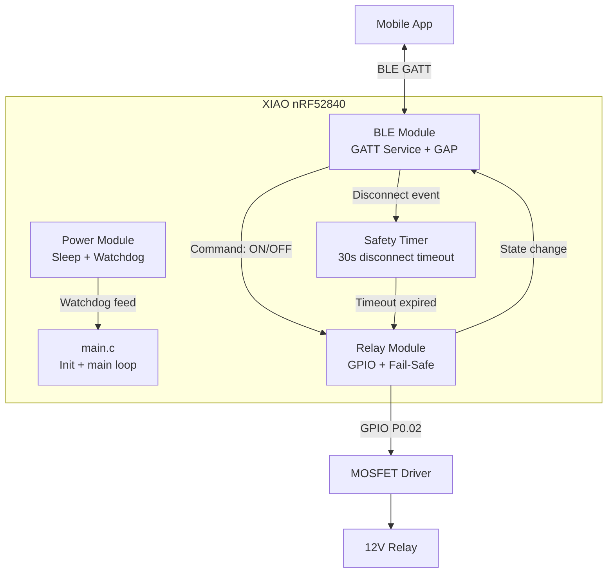
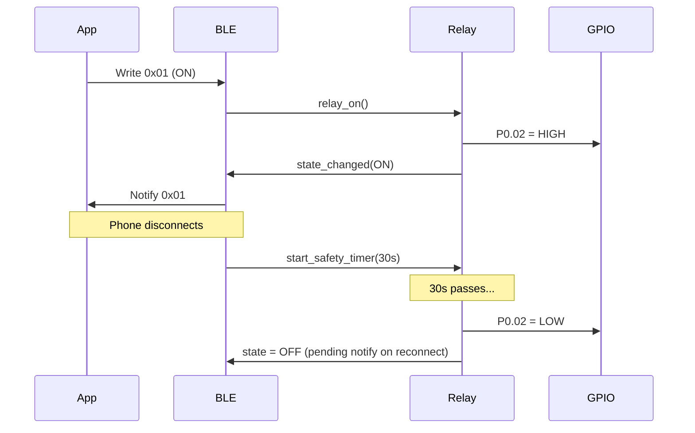

# Firmware Architecture — xiao-remote-button

## Overview

Minimal BLE-controlled relay firmware for Seeed XIAO nRF52840 using nRF Connect SDK (Zephyr RTOS). Designed for ultra-low power operation from a 12V car battery with fail-safe relay control.

## System Diagram



## Module Responsibilities

### main.c
- System initialization sequence
- Start BLE advertising
- Main loop: feed watchdog, idle (Zephyr handles sleep automatically)

### Relay Module (`src/relay/`)
- Control GPIO P0.02 (MOSFET gate)
- Enforce fail-safe: always init to OFF
- Provide API: `relay_init()`, `relay_on()`, `relay_off()`, `relay_get_state()`
- Extensible: relay index parameter for future multi-relay support

### BLE Module (`src/ble/`)
- Custom GATT service registration
- Characteristics:
  - Write: receive ON/OFF command
  - Read: return current relay state
  - Notify: push state changes to phone
- GAP: advertising, pairing (PIN), connection management
- On disconnect: trigger safety timer
- On reconnect: cancel safety timer

### Power Module (`src/power/`)
- Configure hardware watchdog (15s)
- Configure BLE connection intervals for low power
- System enters idle/sleep automatically via Zephyr PM

### Safety Timer
- Starts on BLE disconnect
- 30 second countdown
- On expiry: calls `relay_off()`
- On reconnect before expiry: cancels timer, relay keeps state

## BLE GATT Service

```
Service: Relay Control (custom 128-bit UUID)
├── Relay Command (Write)
│   └── Value: 0x01 = ON, 0x00 = OFF
├── Relay State (Read)
│   └── Value: 0x01 = ON, 0x00 = OFF
└── Relay State (Notify)
    └── Pushed on every state transition
```

**Security**: LE Secure Connections, fixed 6-digit passkey, bonding enabled.

## Data Flow



## Fail-Safe Priority Chain

```
Boot → GPIO LOW (relay OFF)
  → Watchdog start (15s)
    → BLE init + advertise
      → Connected: relay responds to commands
      → Disconnected: 30s timer starts
        → Timer expires: relay OFF
        → Reconnect < 30s: timer cancelled
      → Watchdog timeout: system reset → GPIO LOW → relay OFF
```

## Directory Structure

```
micro/
├── CMakeLists.txt
├── prj.conf
├── boards/
│   └── xiao_ble_nrf52840.overlay
├── src/
│   ├── main.c
│   ├── relay/
│   │   ├── relay.h
│   │   └── relay.c
│   ├── ble/
│   │   ├── ble_relay_service.h
│   │   └── ble_relay_service.c
│   └── power/
│       ├── power.h
│       └── power.c
├── include/
│   └── app_config.h          # Pin definitions, timeouts, UUIDs
└── test/
    ├── test_relay.c
    └── test_safety_timer.c
```

## Configuration Constants (`app_config.h`)

| Constant | Value | Description |
|----------|-------|-------------|
| `RELAY_GPIO_PIN` | P0.02 | MOSFET gate control |
| `RELAY_ACTIVE_LEVEL` | HIGH | HIGH = relay ON |
| `BLE_DISCONNECT_TIMEOUT_S` | 30 | Seconds before fail-safe |
| `WDT_TIMEOUT_S` | 15 | Watchdog timeout |
| `BLE_DEVICE_NAME` | "xiao-relay" | Advertising name |
| `BLE_PIN` | 123456 | Pairing passkey |

## Design Decisions

1. **Single-threaded main loop** — Zephyr BLE callbacks + workqueue, no custom threads needed for MVP
2. **Static allocation only** — No malloc, all buffers and structures at compile time
3. **Extensible relay API** — Functions accept relay index for future multi-relay
4. **Watchdog over software timer** — Hardware watchdog survives firmware bugs
5. **Bonding** — Paired phone reconnects without re-entering PIN

---

## Hardware: Relay Driver Circuit

### Components

| Component | Value | Function |
|-----------|-------|----------|
| Q1 | VNP28N04 (STMicroelectronics) | N-channel OmniFET, autoprotected |
| R1 | 1 kΩ | Gate series resistor (current limit) |
| R2 | 10 kΩ | Gate pull-down (safe OFF at boot) |
| D1 | 1N4007 | Flyback diode (relay coil protection) |
| K1 | 12V relay coil | Load to switch |

### VNP28N04 Key Specs

- Vgs(th): 0.8V min, 3.0V max → **compatible with 3.3V GPIO**
- Rds(on): ~50 mΩ @ Vgs=5V (negligible losses for relay coil current)
- Built-in protections: overcurrent, overtemperature, ESD
- Package: TO-220

### Schematic

```
                          +12V
                           │
                      ┌────┴────┐
                      │  RELAY  │
                      │  COIL   │
                      └────┬────┘
                       D1 ▲│         (1N4007: cathode to +12V)
                      ┌────┴────┐
                      │         │
                      │  DRAIN  │
                      │         │
    XIAO P0.02 ──[R1 1kΩ]──┤  GATE   │  Q1: VNP28N04
                      │         │
              [R2 10kΩ]──┤ SOURCE  │
                      │         │
                     GND       GND
```

### Connections Detail

```
XIAO Pin P0.02 (D0) ───── R1 (1kΩ) ───── Q1 GATE
                                            │
                                       R2 (10kΩ)
                                            │
                                           GND

Q1 SOURCE ──── GND

Q1 DRAIN ───── Relay Coil (terminal -) 
               Relay Coil (terminal +) ──── +12V

D1 Anode  ──── Q1 DRAIN (Relay coil -)
D1 Cathode ─── +12V (Relay coil +)
```

### Design Notes

1. **R1 (1kΩ)**: Limits inrush current to gate capacitance during switching. Prevents GPIO damage.
2. **R2 (10kΩ)**: Ensures MOSFET is OFF during XIAO boot/reset (GPIO is high-Z until configured). Critical for fail-safe.
3. **D1 (1N4007)**: Absorbs inductive kickback from relay coil de-energization. Without it, the voltage spike can destroy Q1.
4. **VNP28N04 autoprotection**: If relay coil draws excessive current or Q1 overheats, it self-limits. Extra safety layer.
5. **GPIO = HIGH → Relay ON**, **GPIO = LOW → Relay OFF** (active-high logic, matches `GPIO_ACTIVE_HIGH` in overlay).

### Power Budget

| State | Current from 12V |
|-------|-----------------|
| Relay OFF | ~0 mA (MOSFET leakage) |
| Relay ON | 50-100 mA (depends on relay coil) |
| XIAO idle (BLE) | ~5 mA (from its own regulator) |
