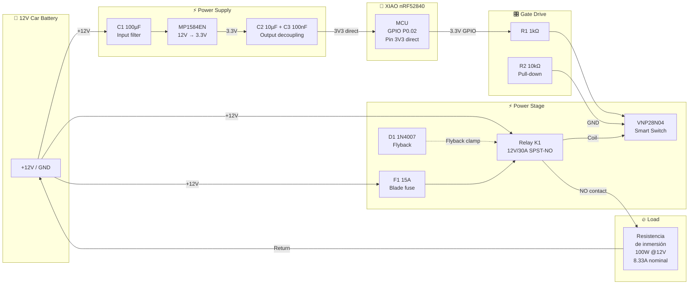

# Driver Design — Power & Relay Circuit

## Overview

Diseño del circuito driver para controlar una **resistencia de inmersión de 100W** (calentador de agua) desde la batería principal de 12V de automóvil, utilizando el XIAO nRF52840 como controlador BLE.

**Requisitos clave:**
- Alimentación directa desde batería 12V del vehículo (MP1584)
- Carga: resistencia de inmersión de **100W @ 12V** (corriente nominal: 8.33A)
- Ultra-bajo consumo en standby (relay OFF) — objetivo: **< 1mA @ 12V**
- Fail-safe: relay OFF en cualquier estado de fallo

---

## Bill of Materials

| Ref | Component | Value / Model | Function |
|-----|-----------|---------------|----------|
| U1 | MP1584EN | Buck DC-DC Module | 12V → 3.3V (alimentación directa XIAO pin 3V3) |
| U2 | VNP28N04 (VNP2804) | N-ch OmniFET (ST VIPower) | Driver del relé, auto-protegido |
| K1 | Relé automotriz | 12V coil, 30A contacts (SPST-NO) | Conmuta la resistencia de inmersión (100W) |
| F1 | Fusible automotriz | 15A, blade type (ATO) | Protección del circuito de carga |
| R1 | Resistor | 1 kΩ, 1/4W | Limitador de corriente de gate |
| R2 | Resistor | 10 kΩ, 1/4W | Pull-down de gate (fail-safe) |
| D1 | 1N4007 | Diodo rectificador 1A/1000V | Flyback protection (coil del relé) |
| C1 | Capacitor | 100 µF / 25V electrolítico | Filtro de entrada (antes del MP1584) |
| C2 | Capacitor | 10 µF / 10V cerámico | Desacoplo en salida 3.3V (near XIAO) |
| C3 | Capacitor | 100 nF / 10V cerámico | Desacoplo HF en 3V3 XIAO |

---

## Electrical Schematic

```
                         +12V (Batería principal)
                              │
         ┌────────────────────┼──────────────────────────┐
         │                    │                           │
         │               ┌────┴────┐                     │
         │               │ F1 15A  │                     │
         │               └────┬────┘                     │
         │                    │                          │
         │               K1 pin 30                       │
         │               (COM)                      K1 pin 85
         │                    │                     (Coil+)
         │                    │                          │
         │              ┌─────┴─────┐              ┌─────┴─────┐
         │              │  RELAY K1 │              │   D1       │
         │              │  (auto)   │              │  1N4007    │
         │              └─────┬─────┘              │  cathode↑  │
         │                    │                    └─────┬─────┘
         │               K1 pin 87                       │
         │               (NO)                       K1 pin 86
         │                    │                     (Coil-)
         │                    │                          │
         │              ┌─────┴──────┐             ┌─────┴─────┐
         │              │ RESISTENCIA│             │  VNP28N04  │
         │              │ INMERSIÓN  │             │   (U2)     │
         │              │  100W      │             │            │
         │              └─────┬──────┘             │  D ← pin86│
         │                    │                    │  G ← R1    │
         │                    │                    │  S → GND   │
         │                    │                    └──┬──┬──────┘
         │                    │                       │  │
    ┌────┴────┐               │                  R1 1kΩ │
    │C1 100µF │               │                       │  │
    │  25V    │               │            XIAO D0 ───┘  │
    └────┬────┘               │            (P0.02)       │
         │                    │                     R2 10kΩ
    ┌────┴────┐               │                          │
    │ MP1584  │               │                          │
    │  (U1)   │               │                          │
    │VIN  VOUT├──┬──[C2+C3]───┼── XIAO pin 3V3          │
    └────┬────┘  │            │                          │
         │       │            │                          │
    ─────┴───────┴────────────┴──────────────────────────┴──── GND
```

---

## Connection Diagram (Simplified)

```
    ╔══════════════════════════════════════════════════════════════════╗
    ║  CONEXIONES — Terminales del relé automotriz ISO Mini          ║
    ╠══════════════════════════════════════════════════════════════════╣
    ║                                                                  ║
    ║   +12V BAT ───┬─── K1 pin 85 (Coil+)                           ║
    ║               │                                                  ║
    ║               ├─── F1 (15A) ─── K1 pin 30 (COM)                ║
    ║               │                                                  ║
    ║               └─── C1 (100µF) ─── MP1584 VIN                   ║
    ║                                                                  ║
    ║   K1 pin 86 (Coil-) ──┬── VNP28N04 Drain (pin 2)              ║
    ║                        └── D1 anode                              ║
    ║                                                                  ║
    ║   D1 cathode ─── K1 pin 85 (Coil+) ─── +12V                   ║
    ║                                                                  ║
    ║   K1 pin 87 (NO) ─── Resistencia inmersión (+)                  ║
    ║                                                                  ║
    ║   Resistencia inmersión (-) ─── GND                             ║
    ║                                                                  ║
    ║   VNP28N04 Source (pin 3) ─── GND                               ║
    ║   VNP28N04 Gate (pin 1) ──── R1 (1kΩ) ─── XIAO D0 (P0.02)    ║
    ║                          └─── R2 (10kΩ) ─── GND                ║
    ║                                                                  ║
    ║   MP1584 VOUT (3.3V) ──┬── C2 (10µF) ─── GND                  ║
    ║                        ├── C3 (100nF) ─── GND                   ║
    ║                        └── XIAO pin 3V3                         ║
    ║                                                                  ║
    ║   MP1584 GND ─── GND                                            ║
    ║   XIAO GND ─── GND                                              ║
    ║                                                                  ║
    ║   ⚠️  XIAO pin 5V: NO CONECTAR                                 ║
    ║   ⚠️  K1 pin 87a (NC): NO CONECTAR                             ║
    ║                                                                  ║
    ╚══════════════════════════════════════════════════════════════════╝
```

---

## Relay Terminal Reference (ISO Mini Automotriz)

```
          ┌─────────────────┐
          │    RELAY K1      │
          │   (vista inferior)│
          │                   │
          │   [87a]   [87]   │      87  = NO (Normally Open) → Carga
          │       [30]       │      30  = COM (Common) ← +12V via fuse
          │   [85]    [86]   │      85  = Coil+ ← +12V
          │                   │      86  = Coil- → VNP28N04 Drain
          └─────────────────┘      87a = NC (no usar)
```

---

## Detailed Component Analysis

### MP1584EN — Buck Converter (12V → 3.3V)

| Parameter | Value |
|-----------|-------|
| Input voltage | 4.5V – 28V (batería principal 12V) |
| Output voltage | **3.3V** (ajustado via feedback resistor) |
| Output current | Up to 3A (solo necesitamos ~15mA max) |
| Efficiency | ~85% at 10mA load, ~92% at 100mA |
| Quiescent current | ~100 µA (PFM mode at light load) |

**Notas de diseño:**
- Se usa un módulo MP1584 pre-ensamblado, ajustado a **3.3V** de salida
- Alimentación directa al pin **3V3** del XIAO → **bypasses el regulador LDO onboard**
- Esto elimina la caída de eficiencia del LDO del XIAO (que consume ~50µA extra)
- El MP1584 entra en PFM (Pulse Frequency Modulation) a baja carga → máxima eficiencia
- C1 (100µF) filtra transitorios de la batería de automóvil (cranking, load dump)
- **IMPORTANTE**: NO conectar nada al pin 5V del XIAO si se alimenta por 3V3

### VNP28N04 — Smart Low-Side Switch

| Parameter | Value |
|-----------|-------|
| Type | N-channel OmniFET (VIPower) |
| V_DS max | 40V |
| I_D continuous | 12A (más que suficiente para coil de relé ~150mA) |
| R_DS(on) | 28 mΩ @ V_GS = 10V |
| V_GS(th) | 1.0 – 2.0V (se activa con 3.3V del XIAO) |
| Protecciones integradas | Over-temperature, over-current, ESD |
| Status flag output | Open drain (no usado en este diseño) |

**¿Por qué VNP28N04 y no un MOSFET discreto?**
1. **Auto-protegido**: thermal shutdown + current limit integrado
2. **V_GS(th) baja**: se activa directamente con 3.3V GPIO — no necesita level shifter
3. **Clamping integrado**: tolera inductancia del relé (D1 es redundancia adicional)
4. **Diseño automotriz**: calificado AEC-Q101, soporta entorno vehicular

### Relé Automotriz (K1) — ISO Mini 12V

| Parameter | Value |
|-----------|-------|
| Coil voltage | 12V DC |
| Coil resistance | ~80Ω (corriente coil ≈ 150mA) |
| Contact rating | 30A @ 14VDC (SPST-NO) |
| Form factor | Mini ISO relay (5-pin) |

**Selección recomendada:** Bosch 0 332 209 150, Song Chuan 896H, u Omron G8QN.

**Terminales ISO Mini (estándar automotriz):**

| Pin | Función | Conexión en este circuito |
|-----|---------|--------------------------|
| **85** | Coil + | → +12V batería |
| **86** | Coil - | → VNP28N04 Drain (pin 2) + D1 anode |
| **30** | COM (entrada potencia) | → +12V via F1 (15A) |
| **87** | NO (Normally Open) | → Resistencia de inmersión (+) |
| **87a** | NC (Normally Closed) | No conectar |

**Configuración SPST-NO (Normally Open):**
- Sin energizar → pin 30 ↔ pin 87 abierto → resistencia de inmersión OFF (fail-safe)
- Energizado → pin 30 ↔ pin 87 cerrado → resistencia de inmersión ON (100W)

### Fusible F1 (15A)

| Parameter | Value |
|-----------|-------|
| Type | Blade fuse (ATO/ATC standard) |
| Rating | 15A |
| Voltage | 32V DC |
| Position | En serie entre +12V y terminal COM del relé |

**Cálculo:**
- Resistencia de inmersión: **100W @ 12V** → I_nominal = 100/12 = **8.33A**
- Corriente de inrush (resistencia fría): puede ser ~1.5x → ~12.5A transitorio
- Fusible 15A = 180% de la corriente nominal → protege contra cortocircuito
- Margen suficiente para no fundir con inrush pero protege contra fallo
- El fusible protege contra cortocircuito en el cableado o la resistencia

---

## Control Logic Truth Table

| GPIO P0.02 | R2 Pull-down | VNP28N04 Gate | MOSFET State | Relay Coil | Relay Contact | Heater |
|-----------|-------------|---------------|-------------|-----------|--------------|--------|
| LOW (0V) | 0V | 0V | OFF (open) | De-energized | Open (NO) | **OFF** ✅ |
| HIGH (3.3V) | Override | ~3.1V | ON (saturated) | Energized | Closed | **ON** |
| High-Z (boot/reset) | 0V | 0V | OFF (open) | De-energized | Open (NO) | **OFF** ✅ |
| Fault (WDT reset) | 0V | 0V | OFF (open) | De-energized | Open (NO) | **OFF** ✅ |

**Fail-safe garantizado en todos los estados de fallo.**

---

## Power Budget

### Active Mode (Relay ON, BLE Connected)

| Component | Current @ 3.3V | Current @ 12V (via MP1584 η≈85%) | Notes |
|-----------|---------------|----------------------------------|-------|
| nRF52840 (BLE TX peak) | 15mA | 4.4mA | During advertising/notify |
| nRF52840 (BLE connected idle) | 3mA | 0.9mA | Between connection events |
| MP1584 quiescent | — | 0.1mA | Overhead del regulador |
| VNP28N04 (gate drive) | — | negligible | Solo carga capacitiva |
| Relay coil | — | 150mA | Directo de 12V |
| **Total active** | — | **~155mA** | Dominado por relay coil |

### Standby Mode (Relay OFF, BLE Advertising)

| Component | Current @ 3.3V | Current @ 12V | Notes |
|-----------|---------------|---------------|-------|
| nRF52840 (slow advertising) | 0.3mA avg | 0.09mA | Interval 1000ms |
| nRF52840 (System ON idle) | 0.002mA | 0.0006mA | Between adv events |
| MP1584 quiescent | — | 0.1mA | PFM mode |
| R2 pull-down leakage | — | negligible | No current (gate at 0V) |
| **Total standby** | — | **~0.2mA** | ✅ Ultra-low power |

### Standby Mode (Relay OFF, BLE Connected, Idle)

| Component | Current @ 3.3V | Current @ 12V | Notes |
|-----------|---------------|---------------|-------|
| nRF52840 (connected idle) | 0.8mA avg | 0.24mA | Interval 500ms, latency 4 |
| MP1584 quiescent | — | 0.1mA | PFM mode |
| **Total standby connected** | — | **~0.35mA** | ✅ Ultra-low power |

### Autonomía estimada (batería coche 60Ah)

| Mode | Current @ 12V | Autonomy |
|------|--------------|----------|
| Standby (no BLE) | 0.2mA | **300,000h ≈ 34 años** (teórico) |
| Standby (BLE advertising) | 0.2mA | **300,000h ≈ 34 años** (teórico) |
| Standby (BLE connected) | 0.35mA | **171,000h ≈ 19.5 años** (teórico) |
| Active (relay ON) | 155mA | **387h ≈ 16 días** |

> Nota: En la práctica, la autodescarga de la batería (~1-3% mensual) limita más que el circuito.

---

## Power Optimization — Ultra-Low Standby

### Estrategia: Minimizar consumo con relay OFF

El objetivo es que el dispositivo sea invisible para la batería del coche cuando el relé está apagado. Se implementan múltiples niveles de optimización:

### 1. Alimentación directa a 3V3 (bypass del LDO onboard)

```
    MP1584 (3.3V out) ──── XIAO pin 3V3 (directo al nRF52840)
                           ╳ NO conectar pin 5V
```

**Ahorro:** ~50-80 µA eliminando el LDO onboard del XIAO (MIC5504) que tiene quiescent current propio.

### 2. BLE Advertising Interval Adaptativo

| Estado | Adv. Interval | Consumo promedio | Justificación |
|--------|--------------|-----------------|---------------|
| Relay OFF + no connection | **2000ms** | ~150 µA | Máximo ahorro, aún detectable |
| Relay ON + disconnected | **200ms** | ~1.5mA | Reconexión rápida importa |
| Post-disconnect (30s) | **200ms** | ~1.5mA | Grace period reconexión |
| After grace period | **2000ms** | ~150 µA | Volver a bajo consumo |

**Implementación firmware:**
```c
// Advertising interval según estado
#define ADV_INTERVAL_SLOW    3200  // 2000ms (slots de 0.625ms)
#define ADV_INTERVAL_FAST     320  //  200ms

void update_advertising_interval(void)
{
    uint16_t interval = relay_get_state() ? ADV_INTERVAL_FAST : ADV_INTERVAL_SLOW;
    // Restart advertising with new interval
}
```

### 3. Connection Parameters Optimizados

| Parameter | Value | Effect |
|-----------|-------|--------|
| Min interval | 400 (500ms) | Menos wakeups |
| Max interval | 800 (1000ms) | Aún más ahorro cuando idle |
| Slave latency | **9** | Puede dormir 9 eventos sin responder |
| Supervision timeout | 2000 (20s) | Tolera alta latencia |

**Con latency 9 y interval 1000ms**: el nRF52840 solo se despierta cada ~10 segundos si no hay datos → consumo medio < 50 µA durante conexión idle.

### 4. Peripherals Deshabilitados

```
# prj.conf — desactivar lo que no se usa
CONFIG_SERIAL=n              # No UART (ahorra ~200µA)
CONFIG_CONSOLE=n             # No console output
CONFIG_UART_CONSOLE=n        # Redundante, pero explícito
CONFIG_LOG=n                 # No logging en producción (opcional)
CONFIG_SPI=n                 # No SPI
CONFIG_I2C=n                 # No I2C
CONFIG_SENSOR=n              # No sensors
CONFIG_USB_DEVICE_STACK=n    # No USB (ahorra ~500µA!)
CONFIG_GPIO_NRF_INT_EDGE=y   # GPIO interrupt-driven
```

**Ahorro estimado:** ~700 µA eliminando UART + USB.

> ⚠️ Para desarrollo/debug, crear un overlay `boards/xiao_ble_debug.overlay` con UART/USB habilitados.

### 5. System ON Idle (Automatic)

El nRF52840 con `CONFIG_PM=y` entra automáticamente en **System ON idle** entre eventos BLE:
- CPU en WFI (Wait For Interrupt)
- RAM retenida
- Periféricos activos selectivamente (solo BLE radio + timer)
- Consumo: **1.5 µA** (CPU idle) + BLE radio periódico

### 6. LED Power — PWM Duty Cycle

Los LEDs RGB consumen corriente significativa. Optimizaciones:

| Estado | LED behavior | Current | Optimization |
|--------|-------------|---------|--------------|
| Relay OFF + no BLE | Green solid | ~2mA | **Dim (10% PWM) o apagar tras 30s** |
| Relay OFF + BLE | Green blink | ~1mA avg | 100ms on / 1900ms off |
| Relay ON + BLE | Blue blink | ~1mA avg | 100ms on / 900ms off |
| Relay ON + no BLE | Blue solid | ~2mA | Mantener (usuario necesita feedback) |

**Propuesta**: Apagar LED completamente tras 60s sin actividad BLE cuando relay OFF → ahorra 2mA.

### 7. Resumen de Optimización Total

| Optimization | Saving | Implementation |
|-------------|--------|----------------|
| 3.3V direct (bypass LDO) | 50-80 µA | Hardware: MP1584 → 3V3 pin |
| Disable UART/USB | 700 µA | prj.conf: CONFIG_SERIAL=n, CONFIG_USB=n |
| Slow advertising (2000ms) | ~1.3mA → 150µA | Firmware: adaptive interval |
| High slave latency (9) | ~500µA | prj.conf: PREF_LATENCY=9 |
| LED auto-off (60s idle) | 2mA | Firmware: LED timeout |
| System ON idle (auto) | automatic | CONFIG_PM=y (ya habilitado) |
| **Total standby (relay OFF, no BLE)** | — | **< 0.2mA @ 12V** ✅ |

---

## Wiring Diagram (Physical Connections)

```
    XIAO nRF52840 Sense                  VNP28N04 (TO-220)
    ┌───────────────────┐                ┌─────────────────┐
    │                   │                │ Pin 1: Gate      │←─ R1 (1kΩ) ←─┐
    │  3V3 ←── MP1584 VOUT (3.3V)       │ Pin 2: Drain    │←─ K1 pin 86   │
    │  GND ←── GND común                │ Pin 3: Source   │──→ GND        │
    │  5V: ⚠️ NO CONECTAR               │ (Tab = Drain)   │               │
    │                   │                └─────────────────┘               │
    │  D0 (P0.02) ─────┼───────────────────────────────────────────────────┘
    │                   │                        │
    └───────────────────┘                   R2 (10kΩ)
                                                 │
                                                GND
```

### Pin-to-Pin Connection Table

| From | To | Wire/Component |
|------|----|----------------|
| +12V Battery | K1 pin 85 | Cable directo (Coil+) |
| +12V Battery | F1 entrada | Cable directo |
| F1 salida | K1 pin 30 | Cable AWG 14 (COM, potencia) |
| K1 pin 87 | Resistencia (+) | Cable AWG 14 (NO, 8.33A) |
| Resistencia (-) | GND | Cable AWG 14 |
| K1 pin 86 | VNP28N04 pin 2 | Cable señal (Coil-, Drain) |
| K1 pin 86 | D1 anode | Cable corto |
| K1 pin 85 | D1 cathode | Cable corto (paralelo a coil) |
| VNP28N04 pin 1 | R1 (1kΩ) | Cable señal (Gate) |
| R1 otro extremo | XIAO D0 (P0.02) | Cable señal |
| VNP28N04 pin 1 | R2 (10kΩ) | Cable corto (Gate pull-down) |
| R2 otro extremo | GND | Cable señal |
| VNP28N04 pin 3 | GND | Cable (Source) |
| +12V Battery | C1 (+) | Cable corto |
| C1 (-) | GND | Cable corto |
| C1 (+) | MP1584 VIN | Cable corto |
| MP1584 VOUT | C2 (+) / C3 (+) | Cable corto |
| C2 (-) / C3 (-) | GND | Cable corto |
| MP1584 VOUT | XIAO pin 3V3 | Cable señal |
| MP1584 GND | GND | Cable |
| XIAO GND | GND | Cable |

---

## PCB / Protoboard Layout Notes

1. **Separar potencia y señal**: el circuito de carga (15A) debe tener pistas anchas o cables gruesos (AWG 14 mínimo)
2. **GND estrella**: conectar todas las tierras en un punto común cerca de la batería
3. **C1 cerca del MP1584**: minimizar inductancia parásita del bucle de entrada
4. **C2 cerca del XIAO**: desacoplo de la alimentación del MCU
5. **R2 cerca del gate**: asegurar pull-down efectivo incluso con ruido en el cableado
6. **D1 lo más cerca posible del relé**: minimizar spike de inductancia en el cableado
7. **Fusible accesible**: colocarlo donde sea fácil de reemplazar

---

## Safety Considerations

### Protección contra load dump (ISO 7637)

La batería de coche puede generar transitorios de hasta 40V (load dump). Mitigaciones:
- MP1584 soporta hasta 28V → añadir **TVS diode** (SMBJ18A) en paralelo a la entrada si se espera entorno severo
- VNP28N04 soporta 40V V_DS → OK directamente

### Protección de la resistencia de inmersión

- **Nunca operar sin agua**: la resistencia puede destruirse en seco → responsabilidad del usuario (señalizar en la app)
- **Timer máximo 6h**: el firmware impone auto-off → protección contra olvido
- **Fusible 15A**: protege contra cortocircuito en la resistencia o cableado

### Thermal considerations

- VNP28N04 disipa: P = I² × R_DS(on) = 0.15² × 0.028 = **0.6mW** → no necesita disipador
- Relay coil: P = 12V × 150mA = **1.8W** → el relé se calienta ligeramente, normal
- MP1584: P_loss ≈ (1 - η) × P_out = 0.15 × 50mW = **7.5mW** → despreciable
- Resistencia de inmersión: **100W** → toda la potencia se disipa en calentar agua
- Cableado de carga (8.33A): usar AWG 14 mínimo (2.08mm²) → < 0.5W en 1m

---

## Integration with Firmware

### Hardware Changes (vs current design)

| Change | Before | After | Reason |
|--------|--------|-------|--------|
| Power input pin | 5V pin | **3V3 pin** | Bypass LDO, lower quiescent |
| MP1584 output | 5V | **3.3V** | Direct to nRF52840 |

### Firmware Changes Required for Power Optimization

| Change | File | Description |
|--------|------|-------------|
| Disable UART/USB | `prj.conf` | `CONFIG_SERIAL=n`, `CONFIG_USB_DEVICE_STACK=n` |
| Slow advertising | `src/ble/ble_relay_service.c` | 2000ms interval when relay OFF |
| Adaptive interval | `src/ble/ble_relay_service.c` | Switch to 200ms when relay ON |
| Higher latency | `prj.conf` | `CONFIG_BT_PERIPHERAL_PREF_LATENCY=9` |
| LED auto-off | `src/led/led.c` | Apagar LED tras 60s idle (relay OFF) |
| Production overlay | `boards/` | Overlay sin UART para release build |

### GPIO y señal de control (sin cambios)

- **GPIO P0.02 (D0)** → HIGH = relay ON, LOW = relay OFF
- **Fail-safe**: R2 pull-down + relay NO = OFF en cualquier estado no controlado
- **Alimentación**: 3.3V al pin 3V3 del XIAO (directo al nRF52840, sin LDO intermedio)

### prj.conf sugerido (producción)

```ini
# Power optimization
CONFIG_PM=y
CONFIG_SERIAL=n
CONFIG_CONSOLE=n
CONFIG_UART_CONSOLE=n
CONFIG_USB_DEVICE_STACK=n
CONFIG_SPI=n
CONFIG_I2C=n

# BLE optimized for power
CONFIG_BT_PERIPHERAL_PREF_MIN_INT=400    # 500ms
CONFIG_BT_PERIPHERAL_PREF_MAX_INT=800    # 1000ms
CONFIG_BT_PERIPHERAL_PREF_LATENCY=9      # Skip 9 events
CONFIG_BT_PERIPHERAL_PREF_TIMEOUT=2000   # 20s timeout
```

---

## Mermaid Diagram


