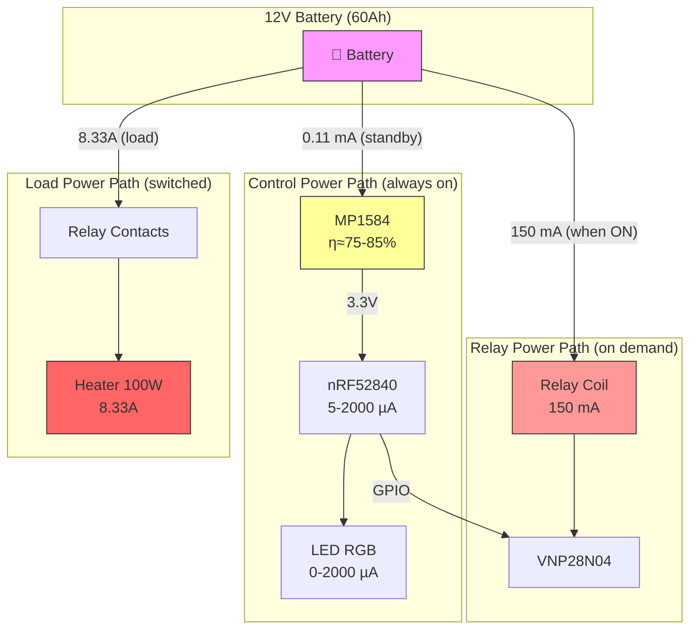

# Power Consumption Study — FIP-remote-button

## 1. Objective

Estudio detallado del consumo energético del sistema FIP-remote-button en todos sus estados de operación, alimentado desde la batería principal de 12V de un vehículo.

**Meta de diseño:** consumo imperceptible para la batería del coche con relay OFF (< 1mA @ 12V).

---

## 2. System Power Architecture

```
    +12V Batería (60Ah típico)
         │
         ├──── [MP1584 Buck] ──── 3.3V ──── XIAO nRF52840 (pin 3V3)
         │         η ≈ 85%                        │
         │                                   GPIO P0.02
         │                                        │
         ├──── Relay Coil (pin 85 → 86) ←── VNP28N04 ←── R1 ←─┘
         │         150mA when ON
         │
         └──── F1 (15A) → Relay contacts (pin 30 → 87) → Carga 100W (8.33A)
```

**Nota**: La corriente de la carga (8.33A) no se considera en el consumo del sistema de control — fluye directamente de la batería a la resistencia a través del relé.

---

## 3. Operating States

El sistema tiene 6 estados de operación distinguibles:

| # | Estado | Relay | BLE | LED | Duración típica |
|---|--------|-------|-----|-----|-----------------|
| S1 | Deep Standby | OFF | Advertising (slow) | OFF (auto-off) | Horas/días |
| S2 | Standby Visible | OFF | Advertising (slow) | Green solid/blink | Primeros 60s |
| S3 | Connected Idle | OFF | Connected | Green blink | Minutos |
| S4 | Active Connected | ON | Connected | Blue blink | Minutos/horas |
| S5 | Active Autonomous | ON | Advertising (fast) | Blue solid | Segundos-minutos |
| S6 | Active Autonomous (settled) | ON | Advertising (slow) | Blue solid | Minutos |

---

## 4. Component-Level Consumption

### 4.1 nRF52840 — MCU & BLE Radio

Datos de referencia: nRF52840 Product Specification v1.1 (Nordic Semiconductor)

| Mode | Current @ 3.3V | Conditions |
|------|---------------|------------|
| System ON, CPU idle (WFI) | 1.5 µA | RAM retained, no peripherals |
| System ON, CPU running | 3.0 mA | 64 MHz, flash execution |
| BLE TX (0 dBm) | 4.6 mA | During packet transmission |
| BLE RX | 4.6 mA | During packet reception |
| System OFF | 0.4 µA | Wake on GPIO/NFC |

**BLE Advertising (calculated average):**

```
I_avg = (T_tx × I_tx + T_idle × I_idle) / T_interval

Advertising event duration: ~1.5ms (3 channels × 0.5ms)
```

| Adv. Interval | Duty Cycle | I_avg @ 3.3V |
|---------------|-----------|--------------|
| 200ms (fast) | 0.75% | ~40 µA |
| 1000ms | 0.15% | ~10 µA |
| 2000ms (slow) | 0.075% | ~5 µA |

**BLE Connection (calculated average):**

```
I_avg = (T_event × I_active + T_sleep × I_idle) / T_effective

Connection event: ~3ms (TX + RX + processing)
T_effective = conn_interval × (1 + slave_latency)
```

| Conn. Interval | Latency | Effective Period | I_avg @ 3.3V |
|----------------|---------|-----------------|--------------|
| 100ms | 0 | 100ms | ~150 µA |
| 500ms | 4 | 2500ms | ~10 µA |
| 500ms | 9 | 5000ms | ~5 µA |
| 1000ms | 9 | 10000ms | ~3 µA |

### 4.2 MP1584EN — Buck Converter

| Parameter | Value | Source |
|-----------|-------|--------|
| Quiescent current (I_q) | 100 µA @ 12V in | PFM mode, no load |
| Efficiency @ 1mA load | ~75% | Light-load PFM |
| Efficiency @ 5mA load | ~82% | PFM/PWM transition |
| Efficiency @ 15mA load | ~85% | PWM mode |
| Efficiency @ 100mA load | ~92% | Full PWM |

**Conversión 3.3V → 12V (para calcular corriente vista desde batería):**

```
I_12V = (I_3.3V × 3.3V) / (12V × η) + I_q

Ejemplo: I_3.3V = 5mA, η = 82%
I_12V = (5mA × 3.3) / (12 × 0.82) + 0.1mA = 1.78mA
```

### 4.3 VNP28N04 — MOSFET Driver

| State | Current | Notes |
|-------|---------|-------|
| Gate OFF (relay OFF) | 0 µA | No current path (gate at 0V via R2) |
| Gate ON (relay ON) | ~1 µA | Gate leakage only (DC steady state) |
| Gate switching | ~3 µA peak | Charging gate capacitance (~1nF × 3.3V / 1kΩ) |

**Contribución al consumo total: despreciable en todos los estados.**

### 4.4 Relay Coil

| Parameter | Value |
|-----------|-------|
| Coil voltage | 12V nominal |
| Coil resistance | ~80Ω |
| Coil current | 12V / 80Ω = **150mA** |
| Power dissipation | 12V × 150mA = **1.8W** |
| Pull-in current (peak) | ~200mA (saturación magnética) |
| Hold current (optional) | ~75mA con PWM 50% (no implementado) |

### 4.5 LED RGB (nRF52840 onboard)

| Color/State | Current @ 3.3V | Notes |
|-------------|---------------|-------|
| Green solid | 2.0 mA | Single LED, series resistor onboard |
| Blue solid | 2.0 mA | Single LED, series resistor onboard |
| Red solid | 2.0 mA | Single LED, series resistor onboard |
| Blink (100ms ON / 900ms OFF) | 0.2 mA avg | 10% duty cycle |
| Blink (100ms ON / 1900ms OFF) | 0.1 mA avg | 5% duty cycle |
| OFF | 0 mA | Auto-off after 60s idle |

### 4.6 Passive Components

| Component | Leakage Current | Notes |
|-----------|----------------|-------|
| R2 (10kΩ pull-down) | 0 µA | No voltage across it when gate = 0V |
| R1 (1kΩ gate series) | 0 µA (OFF) / 3.3µA (ON) | Negligible |
| C1 (100µF electrolytic) | ~5 µA | Leakage at 12V, quality dependent |
| C2, C3 (ceramic) | < 0.1 µA | Negligible leakage |
| D1 (1N4007 reverse) | < 5 µA | Reverse leakage at 12V |

---

## 5. State-by-State Total Consumption

### S1 — Deep Standby (Relay OFF, Advertising Slow, LED OFF)

*Estado predominante: el dispositivo pasa >99% del tiempo aquí.*

| Component | I @ 3.3V | I @ 12V | Calculation |
|-----------|----------|---------|-------------|
| nRF52840 (adv 2000ms + idle) | 7 µA | — | 5µA adv + 1.5µA idle |
| MP1584 conversion | — | 3 µA | (7µA × 3.3V) / (12V × 0.75) |
| MP1584 quiescent | — | 100 µA | Fixed overhead |
| Capacitor leakage (C1) | — | 5 µA | Electrolytic @12V |
| Diode leakage (D1) | — | 5 µA | Worst case |
| **TOTAL S1** | — | **113 µA** | **0.113 mA** |

### S2 — Standby Visible (Relay OFF, Advertising Slow, LED ON)

*Primeros 60s tras boot o tras desconexión BLE.*

| Component | I @ 3.3V | I @ 12V | Calculation |
|-----------|----------|---------|-------------|
| nRF52840 (adv 2000ms + idle) | 7 µA | — | Same as S1 |
| LED green blink (5% duty) | 100 µA | — | 2mA × 5% |
| MP1584 conversion | — | 35 µA | (107µA × 3.3V) / (12V × 0.75) |
| MP1584 quiescent | — | 100 µA | Fixed |
| Passives leakage | — | 10 µA | C1 + D1 |
| **TOTAL S2** | — | **145 µA** | **0.145 mA** |

### S3 — Connected Idle (Relay OFF, BLE Connected, LED Blink)

*App conectada pero no se interactúa.*

| Component | I @ 3.3V | I @ 12V | Calculation |
|-----------|----------|---------|-------------|
| nRF52840 (conn 500ms, lat 4) | 10 µA | — | Effective period 2.5s |
| LED green blink (10% duty) | 200 µA | — | 2mA × 10% |
| MP1584 conversion | — | 77 µA | (210µA × 3.3V) / (12V × 0.75) |
| MP1584 quiescent | — | 100 µA | Fixed |
| Passives leakage | — | 10 µA | C1 + D1 |
| **TOTAL S3** | — | **187 µA** | **0.187 mA** |

### S4 — Active Connected (Relay ON, BLE Connected, LED Blink)

*Relé activado, app conectada — uso normal.*

| Component | I @ 3.3V | I @ 12V | Calculation |
|-----------|----------|---------|-------------|
| nRF52840 (conn 500ms, lat 4) | 10 µA | — | Effective period 2.5s |
| nRF52840 (notify timer 1Hz) | 50 µA | — | Extra wakeups for notify |
| LED blue blink (10% duty) | 200 µA | — | 2mA × 10% |
| MP1584 conversion | — | 95 µA | (260µA × 3.3V) / (12V × 0.75) |
| MP1584 quiescent | — | 100 µA | Fixed |
| Relay coil | — | 150,000 µA | Direct from 12V |
| VNP28N04 gate | — | 1 µA | Steady state |
| Passives leakage | — | 10 µA | C1 + D1 |
| **TOTAL S4** | — | **150,206 µA** | **150.2 mA** |

### S5 — Active Autonomous (Relay ON, Advertising Fast, LED Solid)

*Primeros 30s tras desconexión con relay ON.*

| Component | I @ 3.3V | I @ 12V | Calculation |
|-----------|----------|---------|-------------|
| nRF52840 (adv 200ms + idle) | 40 µA | — | Fast advertising |
| LED blue solid | 2,000 µA | — | Continuous ON |
| MP1584 conversion | — | 748 µA | (2040µA × 3.3V) / (12V × 0.75) |
| MP1584 quiescent | — | 100 µA | Fixed |
| Relay coil | — | 150,000 µA | Direct from 12V |
| VNP28N04 gate | — | 1 µA | Steady state |
| Passives leakage | — | 10 µA | C1 + D1 |
| **TOTAL S5** | — | **150,859 µA** | **150.9 mA** |

### S6 — Active Autonomous Settled (Relay ON, Advertising Slow, LED Solid)

*Tras grace period (30s), relay ON sin conexión BLE.*

| Component | I @ 3.3V | I @ 12V | Calculation |
|-----------|----------|---------|-------------|
| nRF52840 (adv 2000ms + idle) | 7 µA | — | Slow advertising |
| LED blue solid | 2,000 µA | — | Continuous ON (feedback needed) |
| MP1584 conversion | — | 737 µA | (2007µA × 3.3V) / (12V × 0.75) |
| MP1584 quiescent | — | 100 µA | Fixed |
| Relay coil | — | 150,000 µA | Direct from 12V |
| VNP28N04 gate | — | 1 µA | Steady state |
| Passives leakage | — | 10 µA | C1 + D1 |
| **TOTAL S6** | — | **150,848 µA** | **150.8 mA** |

---

## 6. Summary Table

| State | I @ 12V | Power @ 12V | Description |
|-------|---------|-------------|-------------|
| **S1** Deep Standby | **0.11 mA** | **1.4 mW** | Relay OFF, LED OFF, adv slow |
| **S2** Standby Visible | **0.15 mA** | **1.7 mW** | Relay OFF, LED blink, adv slow |
| **S3** Connected Idle | **0.19 mA** | **2.2 mW** | Relay OFF, BLE connected |
| **S4** Active Connected | **150.2 mA** | **1,802 mW** | Relay ON, BLE connected |
| **S5** Active Autonomous Fast | **150.9 mA** | **1,811 mW** | Relay ON, adv fast |
| **S6** Active Autonomous Settled | **150.8 mA** | **1,810 mW** | Relay ON, adv slow |

**Observación clave:** El consumo del sistema de control (MCU + regulador) es < 1mA en todos los estados. El consumo total está completamente dominado por la bobina del relé (150mA) cuando está activado.

---

## 7. Battery Life Estimation

### Batería de referencia: 60Ah, 12V (batería de coche estándar)

#### Scenario A: Solo standby (relay siempre OFF)

```
Autonomía = 60,000 mAh / 0.11 mA = 545,454 horas ≈ 62 años (teórico)
```

> Limitado por autodescarga de la batería (~3%/mes) → vida real ~12 meses sin recargar.

#### Scenario B: Uso típico diario (30 min relay ON / día)

```
Consumo diario:
  - 23.5h × 0.11mA = 2.59 mAh (standby)
  - 0.5h × 150.2mA = 75.1 mAh (active)
  - Total diario = 77.7 mAh

Autonomía = 60,000 mAh / 77.7 mAh/día = 772 días ≈ 2.1 años
```

> Sin considerar recarga del alternador durante conducción.

#### Scenario C: Uso intensivo (2h relay ON / día)

```
Consumo diario:
  - 22h × 0.11mA = 2.42 mAh (standby)
  - 2h × 150.2mA = 300.4 mAh (active)
  - Total diario = 302.8 mAh

Autonomía = 60,000 mAh / 302.8 mAh/día = 198 días ≈ 6.6 meses
```

#### Scenario D: Límite de seguridad (relay ON máximo 6h continuas)

```
Consumo sesión máxima = 6h × 150.2mA = 901.2 mAh (1.5% batería)
```

> Una sesión máxima consume solo el 1.5% de la batería → sin riesgo de descarga.

---

## 8. Comparison: Current vs. Optimized Configuration

### Current firmware (prj.conf actual)

| Parameter | Current Value | I impact @ 3.3V |
|-----------|--------------|-----------------|
| USB CDC enabled | CONFIG_USB=y | +500 µA continuous |
| UART enabled | CONFIG_SERIAL=y | +200 µA continuous |
| Logging enabled | CONFIG_LOG=y | +50 µA (processing) |
| Adv interval | 100-150ms | ~60 µA avg |
| Conn interval | 100-500ms | ~50 µA avg |
| Slave latency | 4 | — |

**Consumo standby actual estimado (con USB/UART): ~900 µA @ 3.3V → ~0.45 mA @ 12V**

### Optimized production firmware (proposed)

| Parameter | Optimized Value | I impact @ 3.3V |
|-----------|----------------|-----------------|
| USB CDC disabled | CONFIG_USB=n | 0 |
| UART disabled | CONFIG_SERIAL=n | 0 |
| Logging disabled | CONFIG_LOG=n | 0 |
| Adv interval (relay OFF) | 2000ms | ~5 µA avg |
| Conn interval | 500-1000ms | ~10 µA avg |
| Slave latency | 9 | Reduces wakeups 2.25× |

**Consumo standby optimizado: ~7 µA @ 3.3V → ~0.11 mA @ 12V**

### Improvement Factor

| Metric | Current | Optimized | Factor |
|--------|---------|-----------|--------|
| Standby @ 12V | 0.45 mA | 0.11 mA | **4× better** |
| Standby power | 5.4 mW | 1.4 mW | **4× better** |
| Annual standby energy | 47 Wh | 12 Wh | **4× better** |

---

## 9. Power Flow Diagram



---

## 10. Energy Distribution (Relay ON Session)

Para una sesión típica de 30 minutos con relay ON:

| Component | Energy (mWh) | % of Total |
|-----------|-------------|-----------|
| Relay coil | 900 | 1.50% |
| MP1584 + MCU + LED | 5 | 0.01% |
| **Load (100W heater)** | **50,000** | **98.49%** |
| **Total from battery** | **50,905** | 100% |

**Conclusión:** El circuito de control es completamente despreciable frente a la carga. El 98.5% de la energía va a calentar agua.

---

## 11. Worst-Case Analysis

### 11.1 Batería baja (10.5V — umbral de descarga)

| Parameter | Nominal (12V) | Low battery (10.5V) |
|-----------|--------------|---------------------|
| MP1584 output | 3.3V | 3.3V (regulado) |
| MP1584 efficiency | 85% | ~80% (menor margen) |
| Relay coil current | 150mA | 131mA (puede no activar) |
| Relay pull-in | OK | ⚠️ Marginal — verificar |

> **Nota**: Algunos relés automotriz requieren ≥9V para pull-in fiable. Con 10.5V normalmente funcionan, pero verificar datasheet del relé elegido.

### 11.2 Temperatura extrema (-40°C a +85°C)

| Effect | Impact |
|--------|--------|
| Battery capacity reduced (-20°C) | ~50% capacity → half autonomy |
| Relay coil resistance drops (cold) | Higher inrush → OK (more margin) |
| nRF52840 leakage increase (hot) | +20% current → negligible |
| MP1584 efficiency (hot) | -2% → negligible |

### 11.3 Load dump (cranking, alternator transient)

| Event | V_peak | Duration | Protection |
|-------|--------|----------|-----------|
| Cranking dip | 6V | 10-40ms | MP1584 survives (VIN_min = 4.5V) |
| Load dump | 40V | <400ms | TVS SMBJ18A recommended |
| Alternator ripple | 14.4V ± 0.5V | continuous | MP1584 OK (max 28V) |

---

## 12. Measurement Plan

Para validar este estudio, medir con multímetro (µA range) o power profiler:

| Test | Expected | How to Measure |
|------|----------|----------------|
| S1 (deep standby) | < 150 µA @ 12V | Series ammeter, wait 60s for LED off |
| S3 (connected idle) | < 200 µA @ 12V | Connect from app, wait 30s idle |
| S4 (relay ON) | ~150 mA @ 12V | Toggle relay ON from app |
| Relay OFF transition | < 1ms to 0 | Oscilloscope on GPIO + coil |
| Boot current peak | < 15mA @ 12V | Oscilloscope on supply |

**Instrumento recomendado:** Nordic Power Profiler Kit II (PPK2) para medir µA con resolución temporal. Alternativamente, INA219 como shunt monitor.

---

## 13. Conclusions

1. **Objetivo cumplido**: El consumo en standby (0.11 mA @ 12V) es **imperceptible** para una batería de coche — equivale a la autodescarga natural.

2. **El relé domina**: Con relay ON, el 99.9% del consumo del sistema de control es la bobina (150mA). El MCU es irrelevante.

3. **La carga domina todo**: El 98.5% de la energía total fluye a la resistencia de inmersión. Todo lo demás es despreciable.

4. **Sin riesgo para la batería**: Incluso con uso diario de 2h, la autonomía supera 6 meses sin recargar. Con uso del vehículo (recarga por alternador), es indefinida.

5. **Optimización necesaria**: Cambiar de la configuración actual (USB/UART habilitados, 0.45mA) a producción (periféricos off, 0.11mA) aporta un factor 4× de mejora en standby.
